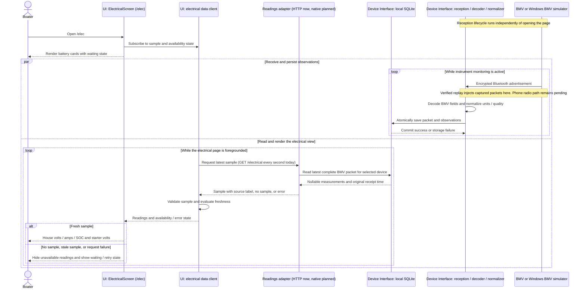

# aiNavLog vertical implementation plan

**Created:** October 5, 2026. **Target:** implementation foundation for the 2027
mobile beta. Six numbered workstreams, with Electrical and deployment running
in parallel from October 5, 2026, followed by four consecutive two-week feature slices.
Dates use America/Vancouver. Each slice spans two calendar weeks; Friday is normally its
demo/review milestone, with holiday exceptions shown below. These are planning targets, not confirmed delivery dates.

## Schedule

| Slice | Two-week window | Demo milestone | Working outcome |
| --- | --- | --- | --- |
| 1. Electrical | Oct 5–18, 2026 | Fri Oct 16 | BMV telemetry received, decoded, stored and displayed on a phone; House / Starter views |
| 2. Store deployment / beta distribution (parallel with 1) | Oct 5–18, 2026 setup; ongoing thereafter | Fri Oct 16 build/install workflow review | Repeatable signed builds, tester installation and update delivery established as accounts become available |
| 3. Engine | Oct 19–Nov 1, 2026 | Fri Oct 30 | Agreed engine measurements received, stored and displayed through the same pipeline |
| 4. Route | Nov 2–15, 2026 | Fri Nov 13 | Record, save, reopen and display a route using available position data |
| 5. Authentication / authorization | Nov 16–29, 2026 | Fri Nov 27 | Sign-in/session lifecycle and enforced access policy for local boat records |
| 6. Route story | Nov 30–Dec 13, 2026 | Fri Dec 11 | Select a recorded route and media, preview a story, then explicitly export/share it |

**Execution updated October 8, 2026:** slices 1 and 2 run concurrently. Deployment
establishes the release environment while Electrical is being implemented, then
continues throughout later slices. A minimal app shell can prove signing and
installation before the complete Electrical slice is ready.

The baseline spans ten weeks, ending December 13, 2026, with the final feature demo
on December 11. Each usable increment can be delivered to testers through the
established workflow. Store/account processing and initial distribution review may
continue beyond October 18; record those dependencies without stopping independent
feature work. Retain final review/rework contingency December 14–27, with holiday
availability potentially extending work into January.

Real-device qualification and final release hardening remain prerequisites for the
complete 2027 beta. Early distribution proves installation and updates for the
available feature set; public-store publication remains a separate decision.

## Delivery approach

Each slice connects source → decode/interpret → local persistence → UI, with
permission/error handling and a repeatable demo. Week one establishes the smallest
working path; week two completes behavior, verifies failures and persistence,
and prepares the demo. The deployment workstream begins alongside Electrical
and supports every subsequent slice. Start the next feature slice after the
preceding feature demo works or its remaining gaps have been explicitly recorded
and accepted; track distribution blockers separately.

Existing HTML pages are design references. The product direction remains React
Native on iOS and Android; Windows simulators and Rust CLI tools support development.
Prove the first electrical path on the available iPhone, with Android build and
functional verification included when a test device/emulator is available. Missing
platform verification must stay visible as a beta qualification gap.

## 1. Electrical

**Status — October 8, 2026:** **In progress.** The `/elec` vertical slice connects
opening the electrical page through Device Interface to decoded, locally persisted
BMV readings. Simulator packet replay to the rendered web UI is verified; native
iPhone Bluetooth reception, Rust bridging and phone-local storage remain in progress.

**Apple Developer enrollment:** **Underway.** The user has initiated the D‑U‑N‑S
lookup/request process as the prerequisite for organization enrollment. D‑U‑N‑S
issuance/verification and Apple Developer membership activation are not yet confirmed.
Next: obtain and verify the company’s D‑U‑N‑S record, complete Apple organization
enrollment, then register the iPhone and prepare a signed development build.

**Week 1:** establish the mobile app shell, navigation and local data contract;
define boat/battery ownership identifiers and future authorization boundaries.
Choose and document the iPhone build/install workflow. Add starter-voltage telemetry
to the BMV simulator, connect native Bluetooth reception to the Rust decoder,
and deliver one stored sample to the electrical screen.

**Week 2:** implement House / Starter selection, current readings, timestamps,
simulated/live labels, missing and stale states, recovery and starter-voltage
trends/low-voltage alerts. Configure alert thresholds explicitly. Verify persistence
across app restart and permissions denied/Bluetooth unavailable behavior.

**Done:** Windows BMV simulator → phone Bluetooth → BMV decoder → local store →
electrical UI works end to end. House shows volts, signed amps and charge %;
Starter shows auxiliary volts, trend and alert status. Starter amps and SOC are
unavailable, never invented or shown as zero. The selector changes views, not
electrical wiring. Alert checks use configured thresholds and unavailable readings
cannot trigger fabricated alerts.

**Baseline:** BMV decoding, normalization, SQLite persistence and synthetic fixtures
already pass software tests. Simulated BLE reception on iPhone has been demonstrated.
Starter auxiliary-voltage simulation was added and fixture-checked on October 6.
The local desktop/web path from captured simulator packets through the Rust monitor,
SQLite and HTTP to the rendered electrical page was verified on October 6, including
changing SOC, stale hiding and recovery. Native mobile reception/bridge integration
remains to implement. No Mac is available. Apple Developer enrollment is now
underway through the D‑U‑N‑S prerequisite; active membership and signing remain open
dependencies for the physical-iPhone milestone. See the
[mobile workflow](mobile-development-workflow.md).
One BMV-712 permanently monitors the house shunt; its auxiliary input measures
starter voltage. Physical BMV accuracy remains unverified. See the
[physical architecture](orion-physical-architecture.md).

**October 6 checkpoint:** the user confirmed the local Device Interface-to-UI
objective is met. Services were stopped at wrap-up. Resume October 7 with the
verified replay baseline, then begin the native mobile reception/Rust integration
and resolve build prerequisites. See [session handoff](status/status-2026-10-06.md).

**October 8 continuation:** preparing the native boundary. The Rust BMV decoder,
monitor, normalizer and SQLite store can now build with `--no-default-features`,
without desktop Bluetooth/D-Bus or NMEA dependencies. Default desktop behavior
is retained, and NMEA remains separately available. This is a host-tested core
boundary, not a native module or a phone build. The user confirmed no Mac and has
initiated the D‑U‑N‑S process for Apple Developer organization enrollment. Next:
the Expo native module/FFI and target packaging while enrollment progresses.
See [mobile workflow](mobile-development-workflow.md#october-8-continuation--shared-rust-core).

**October 8 handoff:** shared-core preparation and the simulator-to-screen
regression check are complete. Apple/Google organization setup awaits D‑U‑N‑S.
Continue native integration and release-environment preparation in parallel.
See [accomplishments and next steps](status/status-2026-10-08.md).

### Electrical vertical-slice sequence

The slice starts when the boater opens `/elec` and extends through the readings
adapter to Device Interface, its decoder and local persistence. Instrument
reception supplies this path continuously; opening the page reads the latest
stored packet rather than commanding a new BMV measurement. Device Interface
supplies data, and `ElectricalScreen` returns and updates the React Native view.

**Verified implementation:** captured encrypted packets from the existing Windows
BMV simulator → production Rust monitor/decoder/normalizer → SQLite → local
`serve-ui` HTTP endpoint → UI polling/validation → rendered `/elec`. The browser
test checks changing values, stale hiding and recovery. Simulator readings are
explicitly labelled, and starter amps/SOC are unavailable.

**Remaining mobile milestone:** Windows BMV Bluetooth broadcast → phone reception
→ native Rust bridge/decoder → phone-local persistence → `/elec`, including denied
permissions, Bluetooth unavailable, recovery and persistence across app restart.
The native adapter's API and update mechanism remain to be selected; the diagram's
current one-second HTTP polling does not commit the mobile design to HTTP.

See [architecture section 5.4.1](../architecture.md#541-user-interface) for component
responsibilities and the sample contract, and [the root README](../README.md#demonstrate-simulator-data-reaching-the-ui)
for the repeatable demonstration and browser test.

## 2. Store deployment and beta distribution

**Status — October 8, 2026:** **Waiting for D‑U‑N‑S number.** Apple enrollment
and Google Play organization registration await the company’s D‑U‑N‑S record.
Google Play developer account setup was initiated on October 8; account creation,
payment and verification are not yet confirmed. Organization setup depends on the
company’s D‑U‑N‑S record. Signed builds and tester distribution are not yet established.

**Objective:** establish an environment where a tested change can be built, installed
and released to testers quickly and repeatedly. This workstream starts with the app
shell and continues through all feature slices; it does not wait for Electrical completion.

**Week 1 (Oct 5–11):** progress Apple/Google account setup, confirm account ownership,
app identifiers and signing approach, and prepare reproducible development and beta
build configurations. Define version/build numbering and a build checklist that
includes Rust, UI and relevant integration checks. Prepare the iPhone registration
and installation workflow while Apple enrollment is pending. Do independent build
configuration work without assuming membership activation or phone access.

**Week 2 (Oct 12–18):** as signing prerequisites become available, build and install
the smallest working app on a real iPhone; verify Android independently when a
test device is available. Establish internal TestFlight/Play testing delivery for
qualified builds, then deliver an Electrical increment. Prove a second build can
update the installed app without losing local data. Record any account, native-build
or distribution blockers at the October 16 review.

**Repeatable release workflow:** validate a concrete change → produce a versioned,
signed artifact → install and smoke-test → distribute to the selected testers →
record build/source version, results and known limitations. Keep build configuration
in the repository and signing credentials in protected tooling. Record build and
installation times so we can measure and reduce release turnaround. Add automation
for repeatable checks/build steps as they are validated. Reuse this workflow during
each feature slice rather than reserving distribution for its end.

**Done for initial setup:** reproducible build commands/configuration are documented;
traceable signed artifacts install on the target devices; testers can receive builds;
and a second build updates successfully with local data retained. Target-platform
gaps remain explicit. Completion depends on observed installs/updates, not only a
successful cloud build. Store metadata, privacy declarations and review access are
prepared when required by the selected distribution channel.

**Ongoing:** distribute usable feature increments, test fresh installs and updates,
maintain release notes and known limitations, and verify permissions/lifecycle after
native changes. Qualify the complete beta after slice 6. Upload, review approval and
public publication are distinct states. Actual external builds/uploads/publication
require authorization when the concrete result is ready; this plan does not perform them.

**Store-controlled timing:** Apple's review-status documentation targets 90% of
submissions within 48 hours; Google says reviews can take up to seven days or longer
in exceptional cases. Neither is an approval guarantee.
[Apple review status](https://developer.apple.com/help/app-review/after-submitting-for-review/review-status),
[Google review/publishing](https://support.google.com/googleplay/android-developer/answer/9859654).

For Google personal developer accounts created after November 13, 2023, production
access requires a closed test with at least 12 testers opted in continuously for
14 days, followed by a production-access application. This affects public release,
not a claim that all beta testing requires production approval. Account type and
eligibility are still unknown; run eligible testing earlier where possible.
[Google testing requirements](https://support.google.com/googleplay/android-developer/answer/14151465).

**Contingency:** account activation, review responses and distribution rework may
overlap feature implementation. Recheck readiness weekly and revise milestones
when prerequisites are delayed. Final beta review/rework is planned for Dec 14–27,
with holiday availability recorded explicitly; processing times are not guarantees.

## 3. Engine

**Week 1:** agree the first engine quantities, units, alert meanings and compatible
source/protocol. Build a simulator for the selected measurements and reuse the
electrical slice's reception, storage and UI contracts.

**Week 2:** complete the engine view with latest values, timestamps, missing/stale
states, reconnection and configured alerts. Verify decoding and persisted history
with representative good, missing and fault samples.

**Done:** selected engine measurements update through a complete simulated path and
survive restart. Supported measurements and physical hardware validation gaps are
documented. Real engine compatibility is not inferred from simulator success.

**Dependency:** engine hardware/gateway and measurement set are not selected yet.
Resolve them before committing to a physical demo; beta instrument connectivity
remains Bluetooth-only and Wi-Fi remains shelved.
This is an open high-priority risk (RISK-03 below), not a confirmed integration
path. By the October 16 review, identify the engine model and available interfaces,
or explicitly scope the October 30 milestone as a simulated demonstration with
physical integration deferred. Any necessary hardware procurement has its own lead time.

## 4. Route

**Week 1:** establish the route/track data model, location source and permissions;
implement start/stop recording and local position persistence. Select map rendering
and attribution requirements. Preserve timestamps and distinguish simulated tracks.

**Week 2:** display live and saved tracks, reopen routes, and handle denied location
permission, signal loss, cancellation and app restart without inventing geometry.
Provide an explicit local route/media association for the later story slice.

**Done:** a short route can be recorded, saved, reopened and displayed. Available
offline recording/display behavior is documented; map availability and background
recording are validated or clearly identified as unsupported. No cloud log upload.

## 5. Authentication / authorization

**Week 1:** finalize the ownership/access policy designed in slice 1 and choose the
identity/session architecture. Implement the first verified provider flow and
protected credential storage; add remaining Google, Facebook and Apple adapters
within the agreed scope.

**Week 2:** enforce authorization at data access boundaries, test provider callbacks,
sign-out, expired sessions, account switching and policy-defined offline access.
Verify access to pre-sign-in local records without data loss or cross-account leaks.

**Done:** supported sign-in flows and session state work, permissions are enforced
beyond hiding UI controls, and unauthorized local-record access is rejected.
Provider coverage and outstanding console/review requirements are explicit.

**Dependencies:** provider setup, signing credentials, any trusted authentication
service, and account/boat access rules must be resolved early. This plan does not
introduce cloud boat-data synchronization or assume multi-user sharing is selected.
See [authentication architecture](../architecture.md#47-authentication-with-google-facebook-and-apple).

## 6. Route story

**Week 1:** select a saved route and local notes/media, compose a story and preview
exactly what will be included. Define the export format and platform handoff.

**Week 2:** implement explicit export/share, cancellation and failure handling,
temporary-file cleanup and missing-route/media behavior. Verify the entire sequence
from recorded route through authorized selection to exported story.

**Done:** a user can preview and export a story built from actual saved content.
No invented track, automatic publishing or claim of successful social publication
based only on a share-sheet handoff. Direct Facebook/Instagram support is validated
per platform; local image export is the fallback when direct handoff is unavailable.

## Reviews and dependencies

### External dependency and risk register

All entries below are **open** at this planning checkpoint. Priority expresses
potential delivery impact, not a measured probability. Proposed owners are roles
to assign; access, budgets and supplier commitments are not assumed confirmed.

| ID / priority | External dependency | Risk and affected outcome | Mitigation / fallback | Proposed owner / resolution checkpoint |
| --- | --- | --- | --- | --- |
| RISK-01 / High | Apple Developer Program, App Store Connect, signing and TestFlight/App Review. **Underway Oct 8:** D‑U‑N‑S lookup/request initiated; membership activation pending. | Enrollment or account access, signing failures, review rejection or resubmission can delay iPhone installs and distribution. Reviewers may be unable to exercise hardware-dependent screens. | Establish account ownership and signing during Electrical; prove a signed install early. Prepare accurate privacy/permission disclosures and reviewer demo access with clearly labeled simulated data. Reserve review/rework contingency; distinguish internal testing, external beta approval and public publication. | Product owner: accounts/access; developer: signing/submission. First signed-install checkpoint Oct 16; build/install workflow review Oct 16; beta upload readiness tracked as enrollment activates. |
| RISK-02 / High | Google Play Console, account verification, app signing, testers and review. **Underway Oct 8:** account setup initiated; registration/payment/verification pending. | Account eligibility or review issues can delay Android distribution. Applicable new personal accounts require 12 continuously opted-in testers for 14 days before applying for production access; recruitment, opt-outs or an unsuccessful application can extend the public-release schedule. | Confirm account type/eligibility early; prove signed Android test distribution. Recruit testers and begin applicable closed testing before deployment. Track eligibility separately from artifact upload and preserve review contingency. | Product owner: account/tester coordination; developer: artifacts/submission. Account/eligibility checkpoint Oct 16; tester readiness checkpoint Oct 16; production eligibility before public submission. |
| RISK-03 / High | Engine manufacturer, installed engine/ECU, available sensors and compatible gateway | **The engine device interface is currently unknown.** Signals may be analog, proprietary or available only through an unconfirmed gateway. Missing public protocol documentation, unsupported measurements, no beta-compatible Bluetooth path, cost or procurement delays can prevent a real engine vertical slice within two weeks. | Identify engine make/model/year, existing instruments, connectors, protocols and required measurements. Verify vendor documentation and a feasible read-only Bluetooth gateway before claiming support. Build a simulator behind the same interface. If unresolved, deliver a clearly simulated engine UI and explicitly defer/replan physical integration; do not silently substitute Wi-Fi or infer compatibility. | Product owner: boat/engine details and access; developer: protocol/gateway feasibility. Discovery checkpoint Oct 16, before Engine starts Oct 19; scope decision at that review. |
| RISK-04 / High | Victron BMV-712 hardware, firmware, owner setup and boat access | Simulator success may not match actual broadcasts, auxiliary starter voltage or installed shunt measurements. Key provisioning, configuration or unavailable boat access can delay qualification. | Validate the actual model/firmware and advertisement key; configure auxiliary voltage and battery parameters; compare house and starter readings with reference measurements. Keep simulator and live data visibly distinct. Physical qualification remains a release prerequisite, with dates assigned once access is known. | Product owner: hardware/access; developer: interoperability. Access plan Oct 16; qualification checkpoint before release candidate acceptance. |
| RISK-05 / High | iOS/Android native Bluetooth/location APIs, device permissions and mobile build tooling | Rust bridge/packaging or OS permission/lifecycle restrictions may prevent reliable reception, recording or background behavior despite passing desktop tests. Build service availability or required native tooling may delay installs. | Choose the build/install workflow in Electrical; demonstrate BLE-to-UI on the physical iPhone early and validate Android separately. Test denied permissions, stale data, reconnect and restart. Explicitly limit unsupported background behavior rather than assume parity. | Developer. End-to-end Electrical checkpoint Oct 16; location/lifecycle checkpoint Nov 13. |
| RISK-06 / High | Apple, Google and Facebook identity providers; developer consoles and any selected authentication service | Provider setup, callback/signing configuration, external approval requirements or an unresolved session/access design can prevent complete authentication in its window. | Establish provider accounts/configuration ahead of slice 5; settle local-record ownership/access before implementation. Verify each intended provider independently and record incomplete coverage. Keep boat data local; do not imply account switching or cloud synchronization is solved by sign-in. | Product owner: provider access; developer: identity/access implementation. Setup checkpoint Nov 13; verified coverage/access review Nov 27. |
| RISK-07 / Medium | Map provider/SDK, location source, map data availability and attribution terms | Rendering, licensing/cost, offline map availability or poor position data can delay the route demo or make saved routes unusable offline. | Select the map/source approach before Route begins; confirm attribution and offline behavior. Persist recorded positions locally and expose gaps. Use a documented local track view if map access is unavailable; never invent geometry. | Developer, with product owner approving costs. Selection checkpoint Oct 30; route acceptance Nov 13. |
| RISK-08 / Medium | Facebook/Instagram platform handoff and mobile share facilities | Target apps, supported formats or platform restrictions may prevent direct story handoff. A completed handoff does not establish that a story was published. | Verify platform handoff on target devices; retain previewed local image export as fallback. Report cancellation/failure accurately and require explicit user sharing. | Developer. Handoff feasibility Nov 27; story acceptance Dec 11. |
| RISK-09 / Medium | External beta testers, physical devices, vendor support and holiday availability | Lack of representative devices/testers or reduced December availability can leave defects undetected and consume review/rework time. | Recruit testers early, schedule boat/device sessions and confirm December availability. Keep platform/hardware evidence explicit; revise dates or scope if prerequisites are missing. | Product owner: coordination; developer: test evidence. Availability checkpoint Oct 16; release workflow review Oct 16; final beta readiness Dec 11. |

Apple/Google distribution timings and Google's account-specific testing requirement
are sourced in slice 2 above. Other entries describe project uncertainties to
validate, not claims that a particular vendor restriction or compatibility problem
already exists. Recheck external requirements before submission.

At each checkpoint, assign an owner, update status and evidence, and record any
scope/date change. An unresolved high-priority dependency must not be reported as
completed merely because its simulated path works. Escalate engine-interface
uncertainty at the Electrical review so it cannot remain hidden until the Engine demo.

At each demo, record what works, evidence from the target platform, unresolved
limitations and next-slice readiness. Preserve simulator fixtures as regression
inputs and run checks appropriate to each change.

The largest early dependency is the iPhone build/install workflow and Rust/native
Bluetooth integration. Engine source selection, maps/location behavior and identity
provider setup are the next uncertainties. Resolve these ahead of their slices;
if they exceed a window, explicitly adjust scope or dates at review.

Post-slice beta work includes physical BMV/engine validation, iOS/Android lifecycle
and background behavior, local data protection/retention, accessibility, installation
and distribution verification, and a release acceptance pass. Schedule it once
the slices establish the remaining effort.
