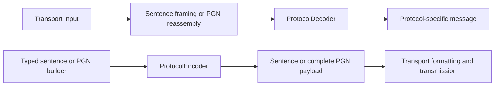

# Rust NMEA library usage

The Device Interface uses **nmea-kit 0.8.9** for NMEA 0183 and **canboat 8.3.0**
for NMEA 2000. Both decode and encode messages through the interfaces in
[`protocol.rs`](../device-interface/src/protocol.rs). This guide describes the
implemented wrappers, not every feature offered by the upstream libraries.

## Dependencies and toolchain

The dependencies are declared in
[`Cargo.toml`](../device-interface/Cargo.toml); exact resolved versions are in
[`Cargo.lock`](../device-interface/Cargo.lock).

```toml
nmea-kit = "0.8.9"
canboat = { version = "8.3.0", default-features = false, features = ["decode"] }
```

nmea-kit uses its default features. CANboat's `decode` feature includes the
embedded PGN database, decoding and encoding. Its default CLI and optional device
I/O features are disabled. The package requires **Rust 1.96 or newer**; development
was verified with Rust 1.98.1.

See the [license inventory](library-licenses.md) for dependency licenses and
notices: nmea-kit offers MIT or Apache-2.0, and CANboat uses Apache-2.0.

## Interfaces and message boundaries

Import `ProtocolDecoder` and `ProtocolEncoder` to call their methods. Each trait
has an associated result type, so implementations retain protocol-specific data.

| Implementation | Decode input → result | Encode input → result |
| --- | --- | --- |
| `Nmea0183Codec` | `str` → `Nmea0183Message` | `Nmea0183Message` → `String` |
| `Nmea2000Codec` | CANboat `Frame` → `DecodedPgn` | CANboat `PgnBuilder` → `Frame` |

Both methods return `DeviceResult<T>`. They perform synchronous, in-memory work
and can be called from an async transport loop. Encoding does not send anything.



Transport implementations must separate incoming sentences and reassemble CAN
fragments before calling these codecs. Mapping their output into `DecodedReading`
and `Observation` is a separate step. The provisional `DeviceProtocolAdapter`
and `ObservationNormalizer` are still stubs; the BLE evaluation CLI does not yet
feed data into the codecs.

## NMEA 0183 with nmea-kit

Implementation: [`nmea0183.rs`](../device-interface/src/protocol/nmea0183.rs).

This example decodes a heading, constructs a new heading using a typed nmea-kit
sentence, and encodes both through the shared interface:

```rust
use ainavlog_device_interface::{
    protocol::nmea0183::{nmea::Hdt, NmeaSentence},
    Nmea0183Codec, Nmea0183Message, ProtocolDecoder, ProtocolEncoder,
};

fn main() -> Result<(), Box<dyn std::error::Error>> {
    let mut codec = Nmea0183Codec;
    let received = codec.decode("$GPHDT,123.456,T*32\r\n")?;

    assert_eq!(received.frame().talker, "GP");
    if let NmeaSentence::Hdt(heading) = received.sentence() {
        println!("True heading in degrees: {:?}", heading.heading_true);
    }

    // Forward the original fields without rounding through typed measurements.
    let forwarded = codec.encode(&received)?;
    assert_eq!(forwarded, "$GPHDT,123.456,T*32\r\n");

    let outgoing = Nmea0183Message::from_sentence(
        "GP",
        &Hdt { heading_true: Some(90.0) },
    )?;
    let wire = codec.encode(&outgoing)?;
    assert!(wire.ends_with("\r\n"));
    Ok(())
}
```

`Nmea0183Message` owns its validated input and typed interpretation:

- `sentence()` returns the typed `NmeaSentence` enum.
- `frame()` exposes the prefix, talker, sentence type, raw fields and tag metadata.
- `as_str()` returns the stored input with trailing CR/LF removed.
- `from_sentence()` accepts nmea-kit types implementing `NmeaEncodable`.
  Standard outbound talkers must be two uppercase ASCII letters/digits.
  Proprietary sentence types supply their own address.

The decoder accepts one ASCII sentence at a time, optionally with CRLF and an
IEC 61162-450 tag block. Supplied checksums are validated; checksumless input is
accepted. Encoding generates a sentence checksum and CRLF and preserves an
existing tag block. It does not guarantee byte-identical whitespace or checksum
letter casing when forwarding.

Missing or malformed numeric measurements follow nmea-kit and become `None`.
Non-finite outbound numeric values become empty fields. Unknown and proprietary
content is retained, even when it has no typed representation. AIS `!` envelopes
are preserved as raw fields; this wrapper does not decode AIS payloads or
reassemble multipart AIS messages, despite the upstream library offering AIS APIs.

## NMEA 2000 with CANboat

Implementation: [`nmea2000.rs`](../device-interface/src/protocol/nmea2000.rs).

A CANboat `Frame` carries a **complete PGN payload**, plus priority, source,
destination and optional timestamp. It can exceed eight bytes. It is not a raw
CAN fragment, USB packet or gateway byte stream.

Use CANboat's schema identifier to create a `PgnBuilder`; generated field IDs
provide typed references to schema fields. Header methods consume and return the
builder, while `push()` mutates it, so bind the builder before adding fields:

```rust
use ainavlog_device_interface::{
    protocol::nmea2000::{ids::field::wind_data as wd, EncodeValue, Units},
    Nmea2000Codec, ProtocolDecoder, ProtocolEncoder,
};

fn main() -> Result<(), Box<dyn std::error::Error>> {
    let mut codec = Nmea2000Codec::new(Units::Si);
    let mut request = codec.message("windData")?
        .source(42)
        .destination(255)
        .priority(2)
        .timestamp("2026-10-01T00:00:00Z");

    request.push(wd::SID, EncodeValue::Int(1))?;
    request.push(wd::WIND_SPEED, 5.23)?; // m/s
    request.push(wd::WIND_ANGLE, 1.5)?; // radians with SI schema
    request.push(wd::REFERENCE, EncodeValue::Lookup("Apparent".into()))?;

    let frame = codec.encode(&request)?;
    assert_eq!(frame.pgn, 130306);
    let decoded = codec.decode(&frame)?;
    assert_eq!(decoded.src, 42);

    if let Some(speed) = decoded.field(wd::WIND_SPEED) {
        println!("Wind speed: {:?} {:?}", speed.value.as_f64(), speed.unit());
    }
    if let Some(angle) = decoded.field(wd::WIND_ANGLE) {
        println!("Wind angle in degrees: {:?}", angle.as_f64_in("deg"));
    }
    Ok(())
}
```

`Nmea2000Codec::default()` selects CANboat's Metric schema. Use `new(Units::Si)`
for SI. Consult each field's units rather than assuming that a numeric value is
already in application units; `as_f64_in()` converts supported unit pairs.

For fields chosen at runtime, the builder also exposes `push_by_name()`, and the
decoded message exposes `field_by_name()`. Native builder methods support repeating
sets. Omitted fields use schema defaults, which can include unavailable sentinels;
inspect `FieldValue::is_not_available()` or optional numeric accessors instead of
substituting zero.

`DecodedPgn` retains PGN identity, CAN header metadata, timestamp, raw payload and
interpreted fields. Unknown PGNs follow CANboat's fallback definitions when
available, or return a decoding error. The wrapper checks priority, PGN range,
maximum payload length and the selected schema's minimum payload length.

Incoming gateway parsing and fast-packet/ISO-TP reassembly, outgoing fragmentation,
address claiming and physical transmission remain transport/integration work.
Setting `.source(42)` only sets message metadata; it does not claim that address.

## Errors and verification

Wrapper errors use `DeviceError::Decode(String)` or `DeviceError::Encode(String)`.
Calls made directly on the re-exported CANboat builder, such as `push()`, return
CANboat errors. The examples use `Box<dyn Error>` to propagate both error types.
A successfully decoded message can still contain missing measurements.

From `device-interface`:

```sh
cargo test --locked --test nmea_codecs
cargo fmt --check
cargo clippy --locked --all-targets -- -D warnings
```

The [codec tests](../device-interface/tests/nmea_codecs.rs) cover heading round
trips, known wind-data bytes, metadata, tag/raw-field preservation, malformed input,
unavailable values and complete PGN payloads longer than one CAN frame. These are
in-memory checks; live gateway and mobile integration have not been validated.

## References

- [nmea-kit 0.8.9 API](https://docs.rs/nmea-kit/0.8.9/nmea_kit/)
- [CANboat 8.3.0 API](https://docs.rs/canboat/8.3.0/canboat/)
- [Device Interface README](../device-interface/README.md)
- [Device Interface class diagram](device-interface-class-diagram.md)
- [Dependency license inventory](library-licenses.md)
