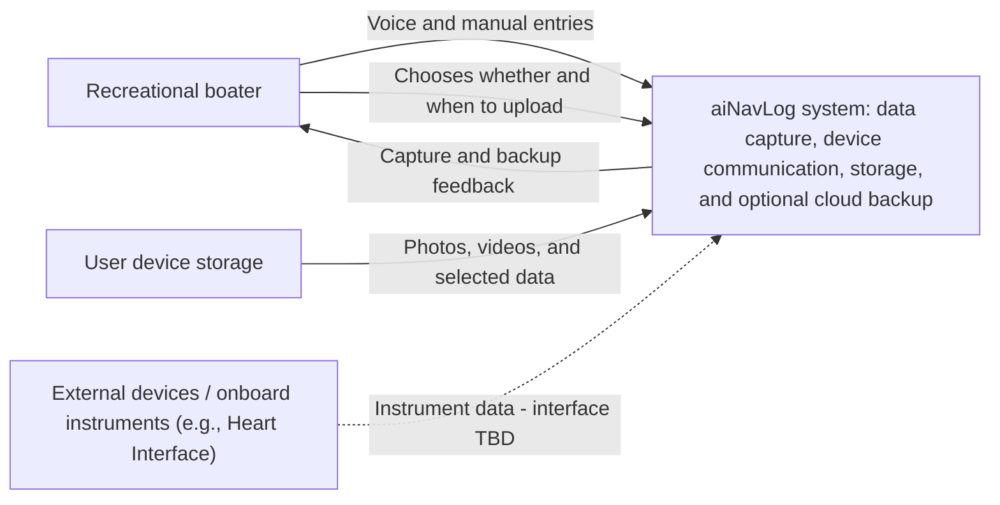
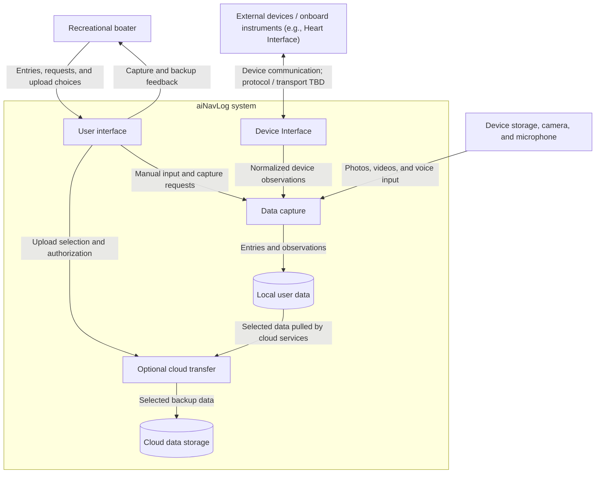

# aiNavLog — Software Architecture Document

| Document field | Value |
| --- | --- |
| Status | Draft — requirements captured; implementation architecture pending |
| Updated | 2026-09-25 |
| Owner | TBD |
| Structure | arc42 |
| Format | GitHub Markdown with Mermaid diagrams |

This document records the requirements established so far. **Confirmed** means stated by the product owner. **Proposed** identifies a design interpretation for review. **TBD** means no decision has been made. Diagrams describe logical responsibilities, not implemented services or deployment locations.

Adapted from the [arc42 template](https://arc42.org/overview/). Official templates and guidance: [downloads](https://arc42.org/download/) and [documentation](https://docs.arc42.org/).

## Contents

1. [Introduction and Goals](#1-introduction-and-goals)
2. [Constraints](#2-constraints)
3. [Context and Scope](#3-context-and-scope)
4. [Solution Strategy](#4-solution-strategy)
5. [Building Block View](#5-building-block-view)
6. [Runtime View](#6-runtime-view)
7. [Deployment View](#7-deployment-view)
8. [Crosscutting Concepts](#8-crosscutting-concepts)
9. [Architectural Decisions](#9-architectural-decisions)
10. [Quality Requirements](#10-quality-requirements)
11. [Risks and Technical Debt](#11-risks-and-technical-debt)
12. [Glossary](#12-glossary)

## 1. Introduction and Goals

Recreational boaters need a convenient way to record onboard observations, media, and maintenance information. The initial version of aiNavLog focuses on collecting and storing this data. 

The goal is to make onboard data capture readily available to the captain, with optional cloud backup.

### 1.1 Purpose

aiNavLog initially provides manual and voice entry, photo and video capture, external-device communication, local data storage, and optional cloud backup. Recommendations, model training, and collective training-data collection are deferred beyond the initial version.

### 1.2 Confirmed initial-version capabilities

| ID | Capability |
| --- | --- |
| R-02 | Accept photos and videos from local device storage, such as an iPhone. |
| R-03 | Support voice entries through a microphone. |
| R-04 | Support manual entries. |
| R-05 | Communicate with external devices, such as Heart Interface, through a Device Interface and incorporate onboard instrument data; specific models and protocols are TBD. |
| R-06 | Allow optional bulk uploads to cloud storage. |
| R-07 | Use cloud services to pull data from users' devices into cloud storage. |

Requirement IDs are retained for traceability; R-01, R-08, and R-09 are deferred beyond the initial version.

### 1.3 Stakeholders

| Stakeholder | Interest | Status |
| --- | --- | --- |
| Recreational boater | Convenient data entry and reliable storage | Confirmed primary user |
| Product owner | Product scope and data-capture workflows | Role; owner TBD |
| Development and operations team | Implementation, deployment, and maintenance | Proposed role; ownership TBD |

### 1.4 Quality goals

Reliable data capture, usability aboard a boat, handling interrupted connectivity, and responsible data handling are proposed quality goals. Measurable acceptance criteria remain TBD.

## 2. Constraints

| Constraint | Status |
| --- | --- |
| Users choose whether and when to upload data to the cloud. | Confirmed |
| Cloud services pull device data into cloud storage. | Confirmed intent; transfer mechanism TBD |
| Cloud storage provider is not selected. | Confirmed |
| Heart Interface is an example external device; specific models and integration protocols are TBD. | Confirmed |
| Supported operating systems, frameworks, budget, and delivery dates | TBD |

The iPhone is an example data source, not a confirmed exclusive platform. Offline capture behavior and backup retry behavior remain TBD.

## 3. Context and Scope

### 3.1 Business context

Recreational boaters use aiNavLog to capture manual entries, voice, photos, videos, and onboard device observations. Data is stored primarily on the smartphone. Users choose whether and when to back up selected data to cloud storage.

### 3.2 System context diagram

The initial-version system boundary includes the application, Device Interface, local storage, optional cloud transfer, and cloud backup storage. AWS is the cloud direction in Section 4; specific services remain TBD.

## 4. Solution Strategy

### 4.1 Application availability

The intent is to make the application generally avaialble and easily installable by users who have smartphones such as iPhone or Android.  

When connected to the internet, the application is also available in the cloud by accessing a url in the user's preferred browser.

To maximize availability, the application will be available in Windows and macOS. 

### 4.2 Data Security

Users own their data and these are primarily (by default) in their smartphone.  

Users can opt to upload their data to the cloud for backup.  AWS cloud services and storage will be used to enable this functionality.

### 4.3 Communication

Bluetooth or WiFi should be the primary mechanism for the application to communicate with external devices. A dedicated Device Interface will handle communication with devices such as Heart Interface and pass observations to data capture. Specific device models, supported protocols, and any required adapters or gateways remain TBD; Bluetooth or WiFi support is not assumed for every device.

TLS 1.3 will be used to communicate with AWS cloud services.

### 4.4 User inputs

Users can use the built-in camera to take photos and videos.
Users can use the built-in microphone to talk to the application.
Manual entries will be supported 

### 4.5 Portability

The application's front end will be developed with ReactNative

## 5. Building Block View

### 5.1 Level 1 — aiNavLog system

**Proposed:** This view decomposes the system boundary in Section 3 into logical responsibilities, following the technology direction in Section 4. These blocks do not imply separate services or deployments.

### 5.2 Building block responsibilities

| Building block | Responsibility and main interfaces | Scope basis |
| --- | --- | --- |
| User interface | Provide data entry, capture feedback, and upload controls. React Native is the frontend direction; platform-specific implementation for the targets in Section 4 remains TBD. | R-02–R-04, R-06; Sections 4.1, 4.4, 4.5 |
| Data capture | Acquire existing and newly captured media, microphone input, manual entries, and normalized observations from the Device Interface. Supply data to local storage. Voice/media processing remains TBD. | R-02–R-05; Section 4.4 |
| Device Interface | Encapsulate communication with external devices such as Heart Interface. Manage connections and device-specific protocol adapters, normalize received observations, and pass them to data capture. Specific models, protocols, and any required gateways remain TBD. | R-05; Section 4.3 |
| Local user data | Retain primary user data on the smartphone by default. Supply selected data for authorized backup transfers. Storage technology and browser/desktop data handling remain TBD. | Section 4.2 |
| Optional cloud transfer | Honor whether and when users choose to upload, including bulk uploads. Coordinate cloud-initiated retrieval into AWS storage over TLS 1.3. Device reachability, permissions, retries, and the pull mechanism remain TBD. | R-06, R-07; Sections 2, 4.2, 4.3 |
| Cloud data storage | Store user-authorized backups. Specific AWS services, retention, and restore behavior remain TBD. | R-06, R-07; Section 4.2 |

### 5.3 Interfaces and open decisions

- Offline capture, synchronization, backup retries, and restore behavior remain TBD.

- Device Interface isolates device-specific communication from data capture. The two-way link represents protocol exchanges; device-control capabilities and supported commands remain TBD.

- Arrows describe data flow, not network connection initiation. Cloud services are intended to pull authorized data; the mechanism must account for device connectivity and platform restrictions.
- Section 2 lists cloud-provider and platform choices as undecided, while Section 4 specifies AWS, platform targets, and React Native. This view follows Section 4; the earlier statements need reconciliation.

