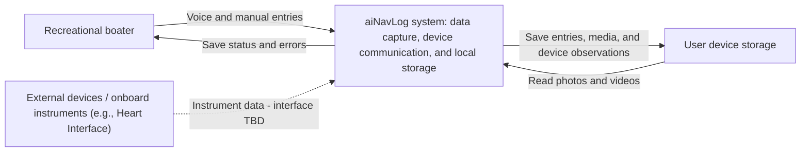
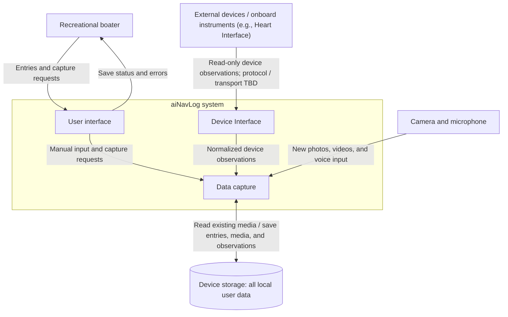

# aiNavLog — Software Architecture Document

| Document field | Value |
| --- | --- |
| Status | Draft — requirements captured; implementation architecture pending |
| Updated | 2026-09-25 |
| Owner | TBD |
| Structure | arc42 |
| Format | GitHub Markdown with Mermaid diagrams |

This document records the requirements established so far. **Confirmed** means stated by the product owner. **Proposed** identifies a design interpretation for review. **TBD** means no decision has been made. Diagrams describe logical responsibilities, not implemented services or deployment locations.

Adapted from the [arc42 template](https://arc42.org/overview/). Official templates and guidance: [downloads](https://arc42.org/download/) and [documentation](https://docs.arc42.org/).

## Contents

1. [Introduction and Goals](#1-introduction-and-goals)
2. [Constraints](#2-constraints)
3. [Context and Scope](#3-context-and-scope)
4. [Solution Strategy](#4-solution-strategy)
5. [Building Block View](#5-building-block-view)
6. [Runtime View](#6-runtime-view)
7. [Deployment View](#7-deployment-view)
8. [Crosscutting Concepts](#8-crosscutting-concepts)
9. [Architectural Decisions](#9-architectural-decisions)
10. [Quality Requirements](#10-quality-requirements)
11. [Risks and Technical Debt](#11-risks-and-technical-debt)
12. [Glossary](#12-glossary)

## 1. Introduction and Goals

Recreational boaters need a convenient way to record onboard observations, media, and maintenance information. The initial version of aiNavLog focuses on collecting and storing this data. 

The goal is to make onboard data capture readily available to the captain, with local data storage.

### 1.1 Purpose

aiNavLog initially provides manual and voice entry, photo and video capture, external-device communication, and local data storage. Recommendations, model training, and collective training-data collection are deferred beyond the initial version.

### 1.2 Confirmed initial-version capabilities

| ID | Capability |
| --- | --- |
| R-02 | Accept photos and videos from local device storage, such as an iPhone. |
| R-03 | Support voice entries through a microphone. |
| R-04 | Support manual entries. |
| R-05 | Communicate with external devices, such as Heart Interface, through a Device Interface and incorporate onboard instrument data; specific models and protocols are TBD. |

Requirement IDs are retained for traceability. R-06 and R-07 (cloud uploads and cloud-initiated data retrieval) are removed from scope. R-01, R-08, and R-09 remain deferred beyond the initial version.

### 1.3 Stakeholders

| Stakeholder | Interest | Status |
| --- | --- | --- |
| Recreational boater | Convenient data entry and reliable storage | Confirmed primary user |
| Product owner | Product scope and data-capture workflows | Role; owner TBD |
| Development and operations team | Implementation, deployment, and maintenance | Proposed role; ownership TBD |

### 1.4 Quality goals

Reliable data capture, usability aboard a boat, handling interrupted connectivity, and responsible data handling are proposed quality goals. Measurable acceptance criteria remain TBD.

## 2. Constraints

| Constraint | Status |
| --- | --- |
| Application data is stored locally; cloud upload and cloud backup are outside scope. | Confirmed |
| Heart Interface is an example external device; specific models and integration protocols are TBD. | Confirmed |
| Supported operating systems, frameworks, budget, and delivery dates | TBD |

The iPhone is an example data source, not a confirmed exclusive platform. Local storage behavior and handling of interrupted device connections remain TBD.

## 3. Context and Scope

### 3.1 Business context

Recreational boaters use aiNavLog to capture manual entries, voice, photos, videos, and onboard device observations. Data is stored locally on the user's device.

### 3.2 System context diagram

The initial-version system boundary includes the user interface, data capture, Device Interface, and local storage.

## 4. Solution Strategy

### 4.1 Application availability

The intent is to make the application generally avaialble and easily installable by users who have smartphones such as iPhone or Android.  

Browser access remains a platform target. Web hosting and browser-local persistence are TBD; browser access does not include uploading user data.

To maximize availability, the application will be available in Windows and macOS. 

### 4.2 Data Security

Users own their data, which is stored locally on the device running the application.  

Local storage technology, access protection, and retention behavior remain TBD.

### 4.3 Communication

Bluetooth or WiFi should be the primary mechanism for the application to communicate with external devices. A dedicated Device Interface will handle communication with devices such as Heart Interface and pass observations to data capture. Specific device models, supported protocols, and any required adapters or gateways remain TBD; Bluetooth or WiFi support is not assumed for every device.

Device communication security will be determined by the selected device protocols and adapters.

### 4.4 User inputs

Users can use the built-in camera to take photos and videos.
Users can use the built-in microphone to talk to the application.
Manual entries will be supported 

### 4.5 Portability

The application's front end will be developed with ReactNative

## 5. Building Block View

### 5.1 Level 1 — aiNavLog system

**Proposed:** This view decomposes the system boundary in Section 3 into logical responsibilities, following the technology direction in Section 4. These blocks do not imply separate services or deployments.

All aiNavLog user data resides in local storage on the device running the application: entries, photos, videos, voice recordings, and device observations. The single storage node includes both existing media read by data capture and data saved by aiNavLog; it does not imply a single database or folder.

### 5.2 Building block responsibilities

| Building block | Responsibility and main interfaces | Scope basis |
| --- | --- | --- |
| User interface | Provide data entry, save status, and error messages. React Native is the frontend direction; platform-specific implementation for the targets in Section 4 remains TBD. | R-02–R-04; Sections 4.1, 4.4, 4.5 |
| Data capture | Acquire existing and newly captured media, microphone input, manual entries, and normalized observations from the Device Interface. Supply data to local storage. Voice/media processing remains TBD. | R-02–R-05; Section 4.4 |
| Device Interface | Encapsulate communication with external devices such as Heart Interface. Manage connections and device-specific protocol adapters, normalize received observations, and pass them to data capture. Specific models, protocols, and any required gateways remain TBD. | R-05; Section 4.3 |
| Device storage | Provide existing media to data capture and retain all aiNavLog user data (entries, photos, videos, voice recordings, and device observations) locally on the device running the application. Storage technology and browser/desktop data handling remain TBD. | Section 4.2 |

### 5.3 Interfaces and open decisions

- Local persistence, storage limits, and offline capture behavior across supported platforms remain TBD.

- Device Interface isolates device-specific communication from data capture. The one-way link represents read-only observations from external devices; the Device Interface does not send commands to external devices.

- Section 2 lists platform choices as undecided, while Section 4 specifies platform targets and React Native. This view follows Section 4; the earlier statements need reconciliation.
