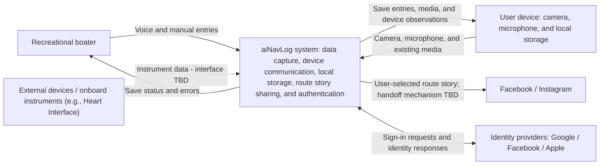
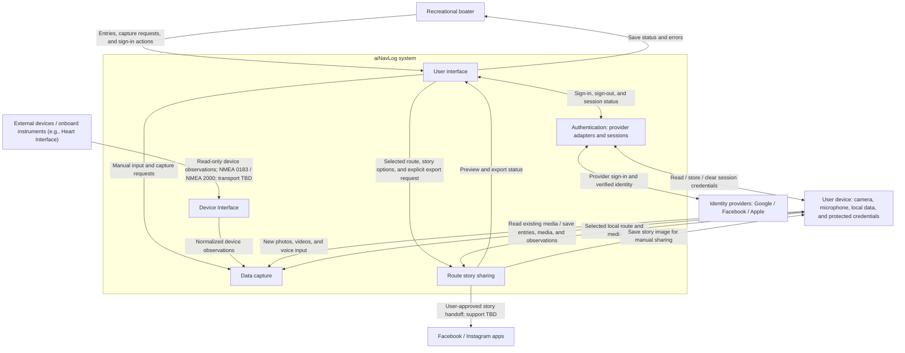
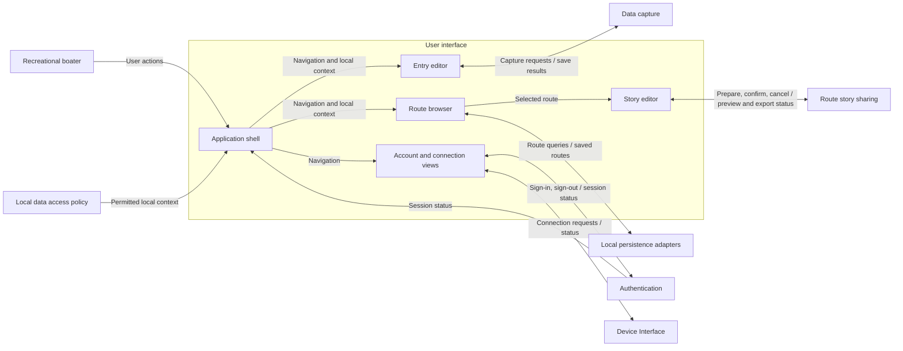
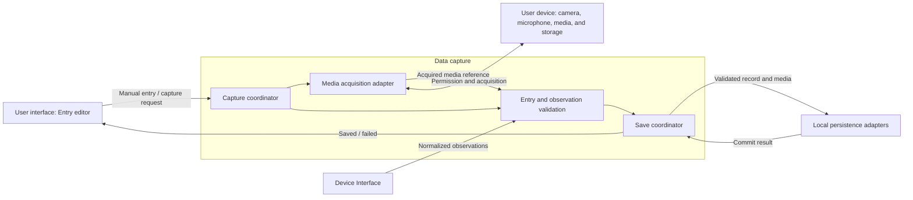
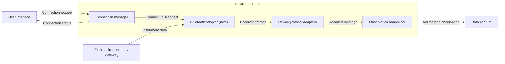
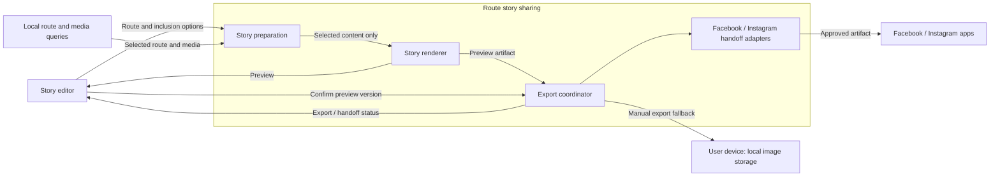
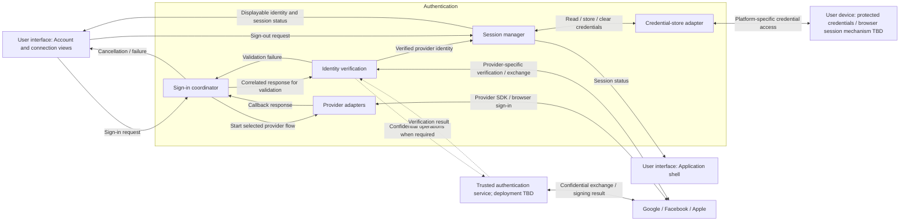

# aiNavLog — Software Architecture Document

| Document field | Value |
| --- | --- |
| Status | Draft — requirements captured; implementation architecture pending |
| Updated | 2026-09-30 |
| Owner | TBD |
| Structure | arc42 |
| Format | GitHub Markdown with Mermaid diagrams |

This document records the requirements established so far. **Confirmed** means stated by the product owner. **Proposed** identifies a design interpretation for review. **TBD** means no decision has been made. Diagrams describe logical responsibilities, not implemented services or deployment locations.

Adapted from the [arc42 template](https://arc42.org/overview/). Official templates and guidance: [downloads](https://arc42.org/download/) and [documentation](https://docs.arc42.org/).

## Contents

1. [Introduction and Goals](#1-introduction-and-goals)
2. [Constraints](#2-constraints)
3. [Context and Scope](#3-context-and-scope)
4. [Solution Strategy](#4-solution-strategy)
5. [Building Block View](#5-building-block-view)
6. [Runtime View](#6-runtime-view)
7. [Deployment View](#7-deployment-view)
8. [Crosscutting Concepts](#8-crosscutting-concepts)
9. [Architectural Decisions](#9-architectural-decisions)
10. [Quality Requirements](#10-quality-requirements)
11. [Risks and Technical Debt](#11-risks-and-technical-debt)
12. [Glossary](#12-glossary)

## 1. Introduction and Goals

Recreational boaters need a convenient way to record onboard observations, media, and maintenance information. The initial version of aiNavLog focuses on collecting and storing this data. 

The goal is to make onboard data capture readily available to the captain, with local data storage.

### 1.1 Purpose

aiNavLog initially provides manual and voice entry, photo and video capture, external-device communication, local data storage, user-initiated route sharing as Facebook or Instagram stories, and sign-in with Google, Facebook, or Apple. Recommendations, model training, and collective training-data collection are deferred beyond the initial version.

### 1.2 Confirmed initial-version capabilities

| ID | Capability |
| --- | --- |
| R-02 | Accept photos and videos from local device storage, such as an iPhone. |
| R-03 | Support voice entries through a microphone. |
| R-04 | Support manual entries. |
| R-05 | Communicate with external devices, such as Heart Interface, through a Device Interface and incorporate onboard instrument data using NMEA 0183 and NMEA 2000 for NMEA-compliant devices; specific models and supported messages remain TBD. |
| R-10 | Enable boaters to share their routes as a Facebook or Instagram story. |
| R-11 | Support OAuth-based sign-in with Google, Facebook, and Apple. |

Requirement IDs are retained for traceability. R-06 and R-07 (cloud uploads and cloud-initiated data retrieval) are removed from scope. R-01, R-08, and R-09 remain deferred beyond the initial version.

### 1.3 Stakeholders

| Stakeholder | Interest | Status |
| --- | --- | --- |
| Recreational boater | Convenient data entry and reliable storage | Confirmed primary user |
| Product owner | Product scope and data-capture workflows | Role; owner TBD |
| Development and operations team | Implementation, deployment, and maintenance | Proposed role; ownership TBD |

### 1.4 Quality goals

**Confirmed:** Minimize the initial download size so users can download and install aiNavLog over the internet as quickly as possible. Keep the dependency footprint small. Platform-specific download-size budgets and download-time targets under defined network conditions remain TBD.

Reliable data capture, usability aboard a boat, handling interrupted connectivity, and responsible data handling are proposed quality goals. Measurable acceptance criteria remain TBD.

## 2. Constraints

| Constraint | Status |
| --- | --- |
| Application data is stored locally; cloud backup and general cloud upload are outside scope. User-initiated export of selected route content to Facebook or Instagram for story sharing is permitted by R-10. | Confirmed |
| Heart Interface is an example external device; specific models and integration protocols are TBD. | Confirmed |
| Rust is the implementation language for services within the aiNavLog system. | Confirmed |
| Beta deployment targets are iOS and Android. Minimum OS versions, supported device architectures, budget, and delivery dates remain TBD. | Confirmed targets; details TBD |
| Dependency licenses must preserve distribution on both beta targets. Prefer permissive dependencies and retain required third-party notices. | Confirmed objective; implementation policy in [library licenses](docs/library-licenses.md#mobile-beta-distribution-policy) |

R-11 requires external identity-provider communication for sign-in. Authentication exchanges do not upload boat logs, routes, or media; any hosted identity/session metadata and authentication service deployment remain proposed decisions in Section 4.7.

The iPhone is an example data source, not a confirmed exclusive platform. The foreground Victron monitor implements local SQLite storage and scan recovery. App-wide storage and mobile connection/background behavior remain TBD.

## 3. Context and Scope

### 3.1 Business context

Recreational boaters use aiNavLog to capture manual entries, voice, photos, videos, and onboard device observations. Data is stored locally on the user's device. Boaters can choose to share selected route content externally as a Facebook or Instagram story; the social platform controls publication and audience settings.

### 3.2 System context diagram

The initial-version system boundary includes the user interface, data capture, Device Interface, route story sharing, and local storage. Authentication is also inside the logical system boundary. Google, Facebook, and Apple act as external identity providers; Facebook and Instagram are external story-sharing destinations.

```mermaid
flowchart LR
    Boater["Recreational boater"]
    Device["User device: camera, microphone, and local storage"]
    Instruments["External devices / onboard instruments (e.g., Heart Interface)"]
    Identity["Identity providers: Google / Facebook / Apple"]
    Social["Facebook / Instagram"]
    System["aiNavLog system: data capture, device communication, local storage, route story sharing, and authentication"]

    Boater -->|"Voice and manual entries"| System
    Device -->|"Camera, microphone, and existing media"| System
    System -->|"Save entries, media, and device observations"| Device
    Instruments -.->|"Instrument data - interface TBD"| System
    System -->|"Save status and errors"| Boater
    System -->|"User-selected route story; handoff mechanism TBD"| Social
    System <-->|"Sign-in requests and identity responses"| Identity
```

## 4. Solution Strategy

### 4.1 Application availability

**Confirmed:** The beta release targets iOS and Android. Make the application easily installable on these mobile platforms. Dependency selection must preserve distribution on both targets; see the [mobile beta licensing policy](docs/library-licenses.md#mobile-beta-distribution-policy).

**Confirmed:** Fast initial download and installation are priorities. Minimize the bytes transferred for installation and avoid unnecessary dependencies and bundled assets.

**Proposed:** Use optimized release builds and platform-specific distribution packages, remove unused code and assets where supported, and compress bundled media. Defer optional large assets until the user requests the related feature; include the resources needed for initial local data capture so first use does not require an additional download. Measure the delivered download size separately from installed size for each supported platform, and review dependency additions for their impact on both. Concrete size budgets and representative network conditions remain TBD.

Browser access remains a longer-term platform target outside the mobile beta. Web hosting and browser-local persistence are TBD; browser access does not include general cloud upload. Route story export is user-initiated; support for direct handoff on each platform remains TBD.

Windows and macOS remain longer-term availability targets. Desktop CLI builds support development and evaluation; they are not beta deployment targets.

### 4.2 Data Security

Users own their data, which is stored locally on the device running the application.  

The foreground Device Interface monitor currently stores Victron observations and reception events in local SQLite using rusqlite. This interim store is unencrypted and has no automatic retention. App-wide storage for logs/media, mobile access protection, and retention policy remain TBD; see the [monitoring guide](docs/victron-live-monitoring.md). Route sharing exports only the content the boater selects and previews; the original route remains local. Published content is subject to the selected social platform's storage and audience controls.

### 4.3 Communication

See the [BMV-712 and Orion physical architecture](docs/orion-physical-architecture.md) for the starter/house battery power path and the separate Bluetooth path to aiNavLog.

**Beta scope:** Bluetooth is the only planned transport for communication with external instruments. Wi-Fi support is shelved for post-beta consideration; see the [backlog](docs/backlog.md#wi-fi-instrument-connectivity). A dedicated Device Interface will handle communication with devices such as Heart Interface and pass observations to data capture. The Victron BMV-712 Smart with its shunt is selected for the 2027 beta release as the source of house-battery voltage, net current and state-of-charge telemetry via Bluetooth Instant Readout. One monitor permanently measures the house bank through its shunt; the auxiliary input measures starter-battery voltage. A House / Starter UI selector shows house voltage/current/SOC and starter voltage/trend/low-voltage alerts. Starter current and SOC are unavailable; no electrical switching or starter SOC estimation is included in the confirmed baseline. BMV production decoding, normalization and local SQLite persistence are implemented and software-tested; mobile integration and physical validation remain pending. Link 2000 is not the selected beta battery telemetry source. Other device models and any required adapters or gateways remain TBD; Bluetooth support is not assumed for every device.

**Confirmed (R-05):** Utilize NMEA 0183 and NMEA 2000 as communication standards for integration with other onboard NMEA-compliant devices through the Device Interface.

**Proposed:** Provide separate protocol adapters for NMEA 0183 and NMEA 2000, using compatible adapters or gateways to connect them to the application over Bluetooth where supported in beta. Normalize received instrument observations for data capture and local storage. The initial integration remains read-only and does not introduce boat-equipment control commands. Supported messages, device compatibility, gateway selection, and platform support remain TBD; NMEA support is not assumed for any particular Heart Interface model.

**Research:** See [Rust Bluetooth libraries](docs/rust-bluetooth-libraries.md) for candidate libraries, platform support, and a proposed evaluation approach. btleplug 0.13.3 is installed for BLE discovery, connection and manufacturer-advertisement reception. Gateway selection and physical/mobile validation remain open.

**Implemented evaluation path:** Separate NMEA codecs use nmea-kit for NMEA 0183 and CANboat for NMEA 2000; framing, gateway reception and NMEA observation mapping remain pending. The Victron vendor decoder supports BMV battery-monitor, Orion DC/DC and XS Instant Readout advertisements. Its foreground monitor handles retries, stale status, duplicate suppression, private key-file reload, normalization and atomic SQLite persistence. See the [class diagram](docs/device-interface-class-diagram.md), [NMEA guide](docs/rust-nmea-libraries.md), and [live monitoring guide](docs/victron-live-monitoring.md). Physical Orion validation, the React Native bridge, mobile permissions, secure key storage and background execution remain pending.

Victron advertisements use unauthenticated AES-CTR. The monitor requires a 32-character hexadecimal advertisement key, separate from the Bluetooth pairing PIN. Other device communication security depends on the selected protocols and adapters.

### 4.4 User inputs

Users can use the built-in camera to take photos and videos.
Users can use the built-in microphone to talk to the application.
Manual entries will be supported 

### 4.5 Portability

The application's front end will be developed with ReactNative

### 4.6 Route story sharing

**Confirmed (R-10):** Boaters can share their routes as a Facebook or Instagram story.

**Proposed:** From a saved route, the boater selects **Share as story**, chooses Facebook or Instagram, and previews a portrait story image generated locally. The story can include a route depiction, trip title, date, distance, and a selected photo. The boater chooses which details to include before export, including whether to expose departure and arrival locations. A proposed image format is 9:16; final dimensions and supported media formats require platform validation.

Use a platform-specific sharing adapter to hand the approved image to the selected app where supported. The boater completes publication and chooses the audience there. Where direct story handoff is unavailable, offer to save the image locally with instructions to add it to a story manually. A successful export or handoff must not be reported as a published story.

Route selection and image preparation should work offline with locally available data. Sharing must be an explicit user action. Missing route geometry must not produce an invented track: offer a summary using available trip details or explain what is missing. Route capture/import, the route data model, map rendering, and any map attribution requirements remain TBD.

### 4.7 Authentication with Google, Facebook, and Apple

**Confirmed (R-11):** Provide sign-in with Google, Facebook, and Apple using their supported OAuth-based authentication integrations.

**Proposed:** An Authentication block isolates provider-specific SDKs, callbacks, identity verification, and session management from the user interface. OAuth authorization alone is not proof of identity: use verified identity tokens where supported and the provider's documented identity-verification flow otherwise. Google's sign-in uses OpenID Connect; see [Google's authentication documentation](https://developers.google.com/identity/openid-connect/openid-connect). Use [Sign in with Apple](https://developer.apple.com/documentation/signinwithapple/authenticating-users-with-sign-in-with-apple) for Apple. Facebook SDK/flow selection requires validation against its current documentation before implementation.

- Present **Continue with Google**, **Continue with Facebook**, and **Continue with Apple**. Request only the identity attributes needed for sign-in; email and display name requirements remain TBD. Missing email or an Apple private relay address must not prevent identifying the user.
- Prefer provider-supported authorization-code flows with PKCE where supported for the selected client type. Use the system authentication browser or supported native SDK. Bind callbacks to the initiating request with state and, for identity-token flows, nonce validation. Register exact redirect URIs separately for each platform and environment.
- Verify identity responses before establishing an application session. For signed identity tokens, validate signature, issuer, audience, expiry, and nonce; use the provider-specific validation procedure for other responses. Reject mismatched, expired, or replayed responses.
- Keep provider client secrets and Apple signing keys out of distributed apps, browser code, and the repository. Any confidential exchange or signing operation belongs in a trusted authentication service. Whether to use a managed service or a dedicated backend, and where it runs, remain TBD.
- Store native session credentials in platform-protected credential storage. Browser session handling remains TBD; a proposed backend uses Secure, HttpOnly cookies with suitable SameSite and CSRF controls. Do not log tokens or authorization codes.
- Identify accounts by provider and verified provider subject/user ID. Never automatically merge accounts by matching email. Linking providers requires an explicit flow that verifies control of both accounts; account linking and recovery remain TBD.
- Keep sign-in consent separate from route story sharing (R-10). Signing in with Facebook grants no assumed permission to publish stories; Google and Apple users can still select either sharing destination.

Boat logs, routes, and media remain local. Authentication does not add synchronization or cloud backup. A hosted authentication component, if selected, should retain only required identity/session metadata; retention and account deletion need definition. Sign-out clears the application session and credentials without implicitly deleting local boating data or claiming to sign the user out of the provider's other apps.

**Open product decisions:** Whether sign-in is mandatory or guest use is supported; which features require a session; offline access and session expiry; local data ownership and isolation when switching accounts; account deletion, revocation, and recovery. These decisions must be resolved before using authentication to gate access to existing local records.

### 4.8 Service implementation language

**Confirmed:** Rust is the chosen implementation language for services within the aiNavLog system. The frontend uses React Native as described in Section 4.5. Service boundaries, deployment locations, Rust frameworks, and frontend-to-service integration remain TBD.

## 5. Building Block View

### 5.1 Level 1 — aiNavLog system

**Proposed:** This view decomposes the system boundary in Section 3 into logical responsibilities, following the technology direction in Section 4. These blocks do not imply separate services or deployments.

```mermaid
flowchart TB
    Boater["Recreational boater"]
    Device["User device: camera, microphone, local data, and protected credentials"]
    Instruments["External devices / onboard instruments (e.g., Heart Interface)"]
    Social["Facebook / Instagram apps"]
    Identity["Identity providers: Google / Facebook / Apple"]
    subgraph System["aiNavLog system"]
        UI["User interface"]
        Capture["Data capture"]
        DeviceInterface["Device Interface"]
        Sharing["Route story sharing"]
        Auth["Authentication: provider adapters and sessions"]
        UI <-->|"Sign-in, sign-out, and session status"| Auth
        UI -->|"Selected route, story options, and explicit export request"| Sharing
        UI -->|"Manual input and capture requests"| Capture
        DeviceInterface -->|"Normalized device observations"| Capture
    end
    Auth <-->|"Provider sign-in and verified identity"| Identity
    Auth <-->|"Read / store / clear session credentials"| Device
    Boater -->|"Entries, capture requests, and sign-in actions"| UI
    UI -->|"Save status and errors"| Boater
    Device -->|"New photos, videos, and voice input"| Capture
    Capture <-->|"Read existing media / save entries, media, and observations"| Device
    Device -->|"Selected local route and media"| Sharing
    Sharing -->|"Preview and export status"| UI
    Sharing -->|"Save story image for manual sharing"| Device
    Sharing -->|"User-approved story handoff; support TBD"| Social
    Instruments -->|"Read-only device observations; NMEA 0183 / NMEA 2000; transport TBD"| DeviceInterface
```

All primary aiNavLog user data, including saved routes, resides in local storage on the device running the application: entries, photos, videos, voice recordings, and device observations. The User device node groups camera, microphone, existing media, application data, and protected credentials. Storage access includes both existing media read by data capture and data saved by aiNavLog; it does not imply a single database or folder. Route story sharing creates a selected export; copies shared to Facebook or Instagram reside outside aiNavLog.

### 5.2 Building block responsibilities

| Building block | Responsibility and main interfaces | Scope basis |
| --- | --- | --- |
| User interface | Provide provider sign-in choices, session status and sign-out, data entry, route selection, story preview and export controls, save status, and error messages. React Native is the frontend direction; platform-specific implementation for the targets in Section 4 remains TBD. | R-02–R-04, R-10–R-11; Sections 4.1, 4.4–4.7 |
| Data capture | Acquire existing and newly captured media, microphone input, manual entries, and normalized observations from the Device Interface. Supply data to local storage. Voice/media processing remains TBD. | R-02–R-05; Section 4.4 |
| Device Interface | Encapsulate communication with external devices such as Heart Interface. Manage connections and device-specific protocol adapters, normalize received observations, and pass them to data capture. Use NMEA 0183 and NMEA 2000 for compatible onboard devices; specific models, supported messages, and any required gateways remain TBD. | R-05; Section 4.3 |
| Route story sharing | Read selected route data and media locally, compose a preview, generate a story image, and manage platform handoff or local image export. Report cancellation and failures without claiming publication. Platform adapters and temporary-file cleanup remain TBD. | R-10; Section 4.6 |
| Authentication | Encapsulate Google, Facebook, and Apple sign-in, callback and identity verification, session lifecycle, and sign-out. Use protected credential storage; any required trusted service deployment remains TBD. | R-11; Section 4.7 |
| User device / Device storage | Provide camera and microphone access, existing media to data capture and retain all aiNavLog user data (entries, saved routes, photos, videos, voice recordings, device observations, and exported story images) locally on the device running the application. Storage technology and browser/desktop data handling remain TBD. | Section 4.2 |

### 5.3 Interfaces and open decisions

- Local persistence, storage limits, and offline capture behavior across supported platforms remain TBD.

- Device Interface isolates device-specific communication from data capture. The one-way link represents read-only observations from external devices; the Device Interface does not send commands to external devices.

- Section 2 lists platform choices as undecided, while Section 4 specifies platform targets and React Native. This view follows Section 4; the earlier statements need reconciliation.

- R-10 requires saved route data; route capture/import and persistence interfaces need definition before implementation. The existing travel-log prototype contains sample trips and social homepage links, not story sharing.
- Validate Facebook and Instagram story handoff support, app registration requirements, supported formats, and platform-specific behavior before choosing integration APIs. A generic share sheet is not assumed to target a story composer.

- R-11 requires provider registrations, redirect configuration, SDK selection per target platform, protected credential storage, and a decision on trusted authentication hosting. No authentication runtime is implemented in the current static prototype.

### 5.4 Level 2 — internal building blocks

**Proposed:** Level 2 opens the Level 1 blocks into modules and their interfaces. These are logical responsibilities, not separate processes, packages, or services. Technology choices remain TBD. Requirement references identify the scope each decomposition supports.

The **User device** groups camera, microphone, existing media, application storage, and protected credential storage. Application modules access these capabilities through platform adapters. The device is a resource boundary, not a claim that every logical component runs locally: confidential authentication operations still require the trusted execution boundary described in Section 4.7.

#### 5.4.1 User interface

**Parent:** User interface. **Scope:** R-02–R-05, R-10, R-11.

```mermaid
flowchart LR
    Boater["Recreational boater"]
    subgraph UI["User interface"]
        Shell["Application shell"]
        Entry["Entry editor"]
        Routes["Route browser"]
        Story["Story editor"]
        Account["Account and connection views"]
        Shell -->|"Navigation and local context"| Entry
        Shell -->|"Navigation and local context"| Routes
        Shell -->|"Navigation"| Account
        Routes -->|"Selected route"| Story
    end
    Boater -->|"User actions"| Shell
    Entry <-->|"Capture requests / save results"| Capture["Data capture"]
    Routes <-->|"Route queries / saved routes"| Persistence["Local persistence adapters"]
    Story <-->|"Prepare, confirm, cancel / preview and export status"| Sharing["Route story sharing"]
    Account <-->|"Sign-in, sign-out / session status"| Auth["Authentication"]
    Auth -->|"Session status"| Shell
    Account <-->|"Connection requests / status"| Devices["Device Interface"]
    Policy["Local data access policy"] -->|"Permitted local context"| Shell
```

| Module | Responsibility | Interfaces |
| --- | --- | --- |
| Application shell | Navigation, active local data context, and display of session state. | Authentication session status; local data access policy. |
| Entry editor | Collect manual input, request photo/video/voice capture, and show save results. | Data capture commands and results. |
| Route browser | List saved routes and open route details for story selection. | Local route queries; route source remains TBD. |
| Story editor | Select destination and included details, display a preview, and confirm export. | Route story sharing preparation, cancellation, and export commands. |
| Account and connection views | Present provider choices, sign-out, device connection state, and recoverable errors. | Authentication commands; Device Interface connection commands/status. |

Views submit user intent and render results. Provider callbacks, device protocols, persistence, and image generation belong to the respective blocks. Session state does not by itself decide ownership of existing local records; the data access policy in Section 4.7 remains a prerequisite.

#### 5.4.2 Data capture

**Parent:** Data capture. **Scope:** R-02–R-05; Section 4.4.

```mermaid
flowchart LR
    UI["User interface: Entry editor"]
    Instruments["Device Interface"]
    Device["User device: camera, microphone, media, and storage"]
    subgraph Capture["Data capture"]
        Coordinator["Capture coordinator"]
        Media["Media acquisition adapter"]
        Validator["Entry and observation validation"]
        Writer["Save coordinator"]
        Coordinator --> Media
        Coordinator --> Validator
        Media -->|"Acquired media reference"| Validator
        Validator --> Writer
    end
    UI -->|"Manual entry / capture request"| Coordinator
    Media <-->|"Permission and acquisition"| Device
    Instruments -->|"Normalized observations"| Validator
    Writer -->|"Validated record and media"| Persistence["Local persistence adapters"]
    Persistence -->|"Commit result"| Writer
    Writer -->|"Saved / failed"| UI
```

| Module | Responsibility | Failure behavior |
| --- | --- | --- |
| Capture coordinator | Track an entry draft and acquisition request; distinguish cancellation from failure. | Preserve usable draft input when capture fails. |
| Media acquisition adapter | Use camera, microphone, or media selection capabilities after required platform permission checks. | Report denied permission, unsupported capability, or cancellation. |
| Entry and observation validation | Check required fields, timestamps, media references, and normalized instrument values; retain source and quality information. | Reject malformed input; do not invent missing readings. |
| Save coordinator | Submit records and associated media to local persistence; return success only after a durable commit. | Report storage failures and allow retry without duplicating a completed save. |

Voice capture initially yields a local recording. Transcription, voice commands, and other media processing are not assumed. Exact validation rules, file limits, draft persistence, and retry identifiers remain TBD.

#### 5.4.3 Device Interface

**Parent:** Device Interface. **Scope:** R-05; Section 4.3.

```mermaid
flowchart LR
    Instruments["External instruments / gateway"]
    UI["User interface"]
    subgraph Interface["Device Interface"]
        Connections["Connection manager"]
        Transport["Bluetooth adapter (beta)"]
        Protocol["Device protocol adapters"]
        Normalizer["Observation normalizer"]
        Connections -->|"Connect / disconnect"| Transport
        Transport -->|"Received frames"| Protocol
        Protocol -->|"Decoded readings"| Normalizer
    end
    UI -->|"Connection request"| Connections
    Connections -->|"Connection status"| UI
    Instruments -->|"Instrument data"| Transport
    Normalizer -->|"Normalized observation"| Capture["Data capture"]
```

| Module | Responsibility | Interfaces |
| --- | --- | --- |
| Connection manager | Track selected device, availability, connection lifecycle, and reconnection policy. | UI commands/status; transport lifecycle. |
| Transport adapters | Encapsulate supported Bluetooth access and platform permissions for beta. | Received frames and transport errors to protocol adapters. |
| Device protocol adapters | Decode supported NMEA 0183 and NMEA 2000 messages and identify source readings. | Raw frames in; typed readings or decoding errors out. |
| Observation normalizer | Produce a common measurement envelope with source, observation/receipt time, quantity, unit, value, and quality status. | Validated envelope to Data capture. |

Instrument readings flow into aiNavLog. Connection setup may require protocol handshakes or subscriptions, but this design exposes no boat-equipment control commands. Unsupported protocols and stale or invalid readings must be visible rather than presented as current measurements. Device models, adapters/gateways, sampling, buffering, and reconnect limits remain TBD; no specific Heart Interface protocol is assumed.

#### 5.4.4 Route story sharing

**Parent:** Route story sharing. **Scope:** R-10; Section 4.6.

```mermaid
flowchart LR
    UI["Story editor"]
    Local["Local route and media queries"]
    subgraph Sharing["Route story sharing"]
        Selection["Story preparation"]
        Renderer["Story renderer"]
        Export["Export coordinator"]
        Adapters["Facebook / Instagram handoff adapters"]
        Selection -->|"Selected content only"| Renderer
        Renderer -->|"Preview artifact"| Export
        Export --> Adapters
    end
    UI -->|"Route and inclusion options"| Selection
    Local -->|"Selected route and media"| Selection
    Renderer -->|"Preview"| UI
    UI -->|"Confirm preview version"| Export
    Adapters -->|"Approved artifact"| Social["Facebook / Instagram apps"]
    Export -->|"Manual export fallback"| Device["User device: local image storage"]
    Export -->|"Export / handoff status"| UI
```

| Module | Responsibility | Interfaces |
| --- | --- | --- |
| Story preparation | Read a saved route, apply the boater's inclusion choices, and prepare only selected content. | Local read interfaces; story content model. |
| Story renderer | Produce a local portrait image and preview from that content; use a summary when geometry is absent. | Versioned preview artifact and rendering errors. |
| Export coordinator | Bind confirmation to the previewed artifact, manage temporary files, and offer local export fallback. | Confirm/cancel requests; file export and handoff results. |
| Destination adapters | Encapsulate each platform's supported story handoff and capability checks. | Artifact handoff to Facebook or Instagram; unavailable/cancelled/failed status. |

Changing the route or inclusion options invalidates the previous confirmation. Export uses the same artifact the boater approved. Handoff success means content was passed to another app, not that a story was published. Temporary-file lifetime must accommodate destination-app access; cleanup timing and persisted export retention remain TBD.

#### 5.4.5 Authentication

**Parent:** Authentication. **Scope:** R-11; Section 4.7.

```mermaid
flowchart LR
    Account["User interface: Account and connection views"]
    Shell["User interface: Application shell"]
    Providers["Google / Facebook / Apple"]
    Storage["User device: protected credentials / browser session mechanism TBD"]
    subgraph Auth["Authentication"]
        Coordinator["Sign-in coordinator"]
        Adapters["Provider adapters"]
        Verification["Identity verification"]
        Sessions["Session manager"]
        Credentials["Credential-store adapter"]
        Coordinator -->|"Start selected provider flow"| Adapters
        Adapters -->|"Callback response"| Coordinator
        Coordinator -->|"Correlated response for validation"| Verification
        Verification -->|"Verified provider identity"| Sessions
        Verification -->|"Validation failure"| Coordinator
        Sessions <-->|"Read / store / clear credentials"| Credentials
    end
    Account -->|"Sign-in request"| Coordinator
    Coordinator -->|"Cancellation / failure"| Account
    Adapters <-->|"Provider SDK / browser sign-in"| Providers
    Verification <-->|"Provider-specific verification / exchange"| Providers
    Verification -.->|"Confidential operations when required"| Trusted["Trusted authentication service; deployment TBD"]
    Trusted <-->|"Confidential exchange / signing result"| Providers
    Trusted -.->|"Verification result"| Verification
    Account -->|"Sign-out request"| Sessions
    Sessions -->|"Displayable identity and session status"| Account
    Sessions -->|"Session status"| Shell
    Credentials <-->|"Platform-specific credential access"| Storage
```

The trusted service represents the execution boundary for confidential operations within the logical Authentication block. Provider-specific verification may use that service; the arrows show possible interfaces, not a requirement to run both client and service exchanges. The browser session mechanism remains subject to the hosting decision in Section 4.7.

| Module | Responsibility | Interfaces / boundary |
| --- | --- | --- |
| Sign-in coordinator | Start a provider request, correlate its callback, and report cancellation or failure. | UI sign-in request; provider adapter result. |
| Provider adapters | Encapsulate Google, Facebook, and Apple platform integrations and supported identity flows. | Provider SDK/browser interaction; opaque callback response to verification. |
| Identity verification | Verify the provider response and return a provider-qualified identity only after successful validation. | Confidential exchange/signing operations execute in a trusted service when required; deployment TBD. |
| Session manager | Establish, restore, expire, and clear the application session using verified identity. | Session status to UI; credential-store access; reauthentication result. |
| Credential-store adapter | Isolate platform-specific credential storage and removal. | Protected native storage or selected browser/session-service mechanism. |

The UI receives displayable identity and session status, not provider tokens. The trusted authentication boundary may be hosted and must not receive boating records. Its identity/session metadata is separate from local boating persistence. Provider linking, revocation handling, session lifetimes, and offline access remain explicit open decisions; this decomposition does not resolve them implicitly.

#### 5.4.6 User device and local persistence

**Parent resource:** Device storage, grouped with camera and microphone as the User device. **Scope:** R-02–R-05, R-10; Section 4.2. Protected credentials support R-11 through Authentication only.

Camera/microphone access is owned by the Data capture media adapter. Protected credential access is owned by Authentication. The following proposed application adapters provide the local storage interface shown at Level 1; the physical storage technology remains TBD.

| Module | Responsibility | Consumers |
| --- | --- | --- |
| Record repository | Save/query manual entries and instrument observations with stable identifiers and provenance. | Data capture; UI queries. |
| Route repository | Read saved route summaries and optional geometry; define a future write interface once capture/import is specified. | Route browser; Story preparation. |
| Media store | Import or retain media, resolve local references, and manage temporary/exported images. | Data capture; Route story sharing. |
| Local commit coordinator | Coordinate record and media writes and report durable success; recover incomplete writes or clean up orphaned temporary files. | Data capture Save coordinator. |
| Local data access policy | Enforce the selected local owner/context consistently for reads and writes. | All repositories and media access; ownership/guest policy TBD. |

A single User device box does not imply a single database. The application must define consistency across records and files before implementation. Schema migration, capacity limits, retention, encryption, and browser eviction behavior remain TBD. Signing into the same identity on a second device does not make the first device's boating data available there.

#### 5.4.7 Interfaces between blocks

These are proposed logical contracts, not committed API signatures or serialization formats.

| Contract | Producer → consumer | Minimum meaning |
| --- | --- | --- |
| Capture request | UI → Data capture | Request identifier, active local context, input type, and draft content/media choices. |
| Normalized observation | Device Interface → Data capture | Source identity, measurement type, value/unit, timestamps, and quality; unavailable source time is explicit. |
| Save result | Local persistence → Data capture → UI | Record identifier on durable success, or a recoverable/nonrecoverable failure; retries preserve operation identity. |
| Route snapshot | Local persistence → UI / Route story sharing | Route identifier/version, available trip details, optional geometry, and media references scoped to the local context. |
| Story preview | Route story sharing → UI | Artifact identifier/version, selected content, and render status. |
| Export request/result | UI ↔ Route story sharing | Confirmed artifact/version and destination; saved, handed off, cancelled, unavailable, or failed result. |
| Session status | Authentication → UI / access policy | Verified identity reference where available and session state; no raw credentials. |
| Connection status | Device Interface → UI | Source device, connection state, last observation time, and actionable error where applicable. |

Before implementation, prioritize the route source/model, local ownership and guest policy, persistence technology, authentication hosting, and one supported instrument/protocol combination. Each choice should refine these interfaces without moving provider or hardware details into the UI.

## 6. Runtime View

### 6.1 Share a route as a story (R-10)

**Proposed workflow:**

1. The boater opens a saved route and selects **Share as story**.
2. The user interface asks for Facebook or Instagram and the details/media to include.
3. Route story sharing reads the selected local data and generates a preview. The boater can edit the selection or cancel without exporting.
4. On explicit confirmation, the sharing adapter hands the story image to the selected app if supported, or saves it locally for manual story creation.
5. The boater completes publication in Facebook or Instagram. aiNavLog reports only export/handoff status unless publication confirmation is actually available.

**Proposed acceptance criteria:**

- Both Facebook and Instagram have a sharing path, using local image export when direct story handoff is unavailable.
- The exported image matches the preview and includes only the selected route details and media; unrelated log entries and instrument observations are excluded.
- Cancelling the preview sends no content externally. Cancelling a handoff is not reported as publication or retried automatically.
- An unavailable app, unsupported sharing capability, or failed handoff leaves the saved route intact and offers local export or an actionable retry. Local export failures show an error and allow retry.
- A route with missing geometry can produce an accurately labelled trip summary without a fabricated track; a route with insufficient data produces a clear explanation.
- Preview generation works offline with local data and assets. Any network-dependent publication is handled by the destination platform.

### 6.2 Sign in with Google, Facebook, or Apple (R-11)

**Proposed workflow:**

1. The boater selects a provider. Authentication creates a short-lived sign-in request with callback correlation and applicable replay protection.
2. The provider's supported sign-in interface authenticates the boater and requests consent. aiNavLog never collects the provider password.
3. Authentication receives the callback, validates the pending request, and completes the provider-specific exchange and identity verification, using a trusted service for confidential operations where required.
4. Authentication resolves the provider identity, establishes an application session, stores credentials using the platform's protected mechanism, and reports sign-in success to the user interface.
5. On sign-out, aiNavLog clears its session and credentials. Local boating data is preserved according to the account ownership/access policy to be defined in Section 4.7.

**Proposed acceptance criteria:**

- Each provider completes sign-in on every supported target using a validated platform integration; the provider/platform support matrix is defined before implementation.
- Cancellation, denied consent, network failure, and unavailable providers return a clear status and allow retry without creating a session or altering local boating data.
- Invalid signatures, unexpected issuer/audience, expired tokens, callback state/nonce mismatch, and replayed responses cannot create a session, as applicable to the provider flow.
- Missing optional profile fields and private relay email addresses do not cause duplicate identity creation or automatic account merging.
- Session expiry or revoked credentials require reauthentication for protected operations; offline access follows the explicit policy from Section 4.7 and is not represented as fresh provider authentication.
- Sign-out clears credentials; account switching cannot expose another account's local records. The local data ownership policy must be defined and tested before release.
- Sign-in alone neither uploads routes/media nor publishes stories. Secrets and tokens are absent from distributed source, ordinary local storage, and diagnostic logs.

### Implementation schedule

See the [vertical implementation plan](docs/project-plan.md): Electrical, Engine, Route, Authentication/authorization, then Route story; two weeks per slice starting October 5, 2026. This establishes the implementation foundation for the 2027 beta; release qualification is scheduled separately.
