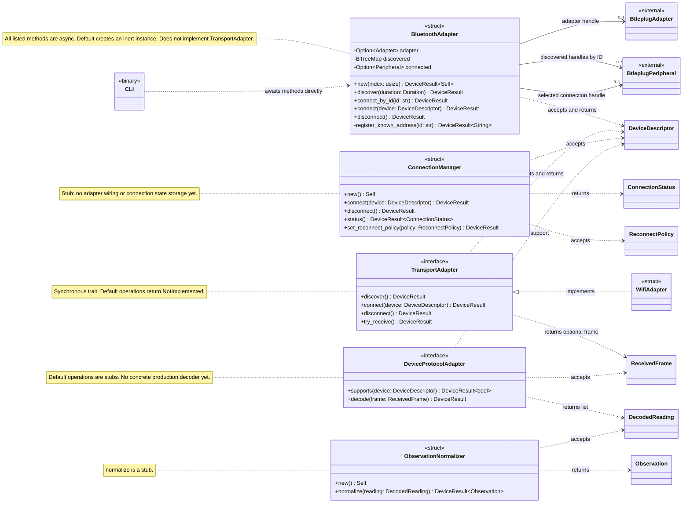
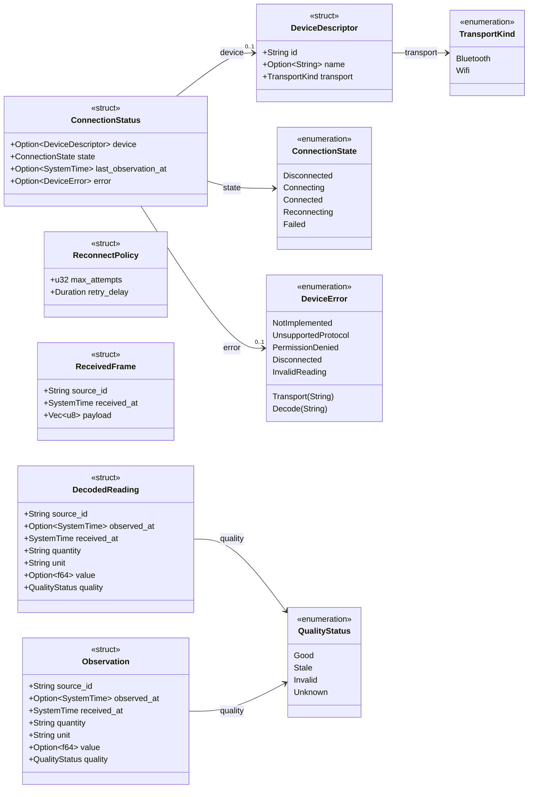

# Device Interface UML class diagram

This diagram describes the Rust code in `device-interface/src`, reviewed on
2026-09-30. Rust structs are shown as classes and traits as interfaces. It reflects
the current implementation rather than the proposed architecture.

## Components and dependencies

Solid arrows represent stored handles; dotted arrows represent use through method
arguments or results. The hollow triangle denotes trait implementation. `btleplug`
handles are shared/clonable, so they are not shown as exclusively owned UML
compositions. A selected connection handle can be retained after a failed attempt
for cleanup; its presence alone does not establish a live connection.

All operations returning `DeviceResult` use the alias
`DeviceResult<T> = Result<T, DeviceError>`. To keep signatures readable, Rust
borrows and some nested generic return types are abbreviated:

| Method | Successful result |
| --- | --- |
| Both `discover` methods | `Vec<DeviceDescriptor>` |
| `TransportAdapter::try_receive` | `Option<ReceivedFrame>` |
| `DeviceProtocolAdapter::decode` | `Vec<DecodedReading>` |
| Connect, disconnect, and set-reconnect-policy operations | `()` |

`BluetoothAdapter::register_known_address` is private and platform-specific:
Windows can register an explicit Bluetooth address with btleplug; other platforms
currently return an error for an ID absent from discovery. The CLI uses
`connect_by_id` after scanning.

## Data contracts

`DecodedReading` and `Observation` are independent structs with matching fields;
neither inherits from the other. Missing timestamps and measurements remain
explicit through `Option`. Device IDs are opaque identifiers, not universally MAC
addresses.

## Source references

- [Bluetooth implementation](../device-interface/src/bluetooth.rs)
- [Transport trait and WiFi stub](../device-interface/src/transport.rs)
- [Connection manager](../device-interface/src/connection.rs)
- [Protocol trait](../device-interface/src/protocol.rs)
- [Normalizer](../device-interface/src/normalizer.rs)
- [Data contracts](../device-interface/src/types.rs)
- [CLI](../device-interface/src/main.rs)
- [Build and usage instructions](../device-interface/README.md)

The operational BLE adapter is not yet wired into the synchronous transport trait
or `ConnectionManager`. Notification reception, protocol decoding, normalization,
and the React Native bridge remain future work.
