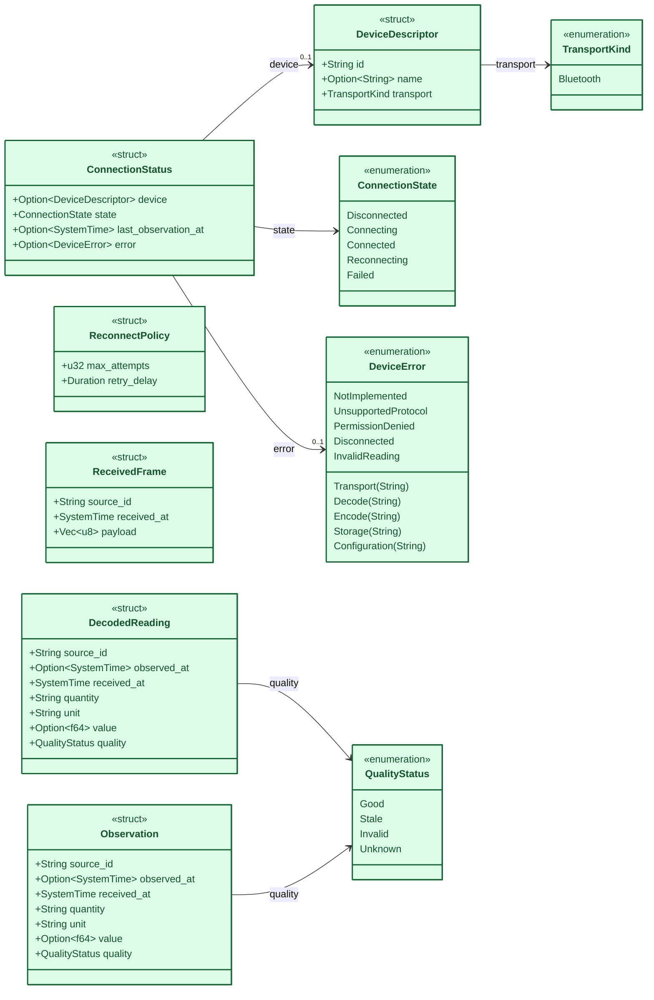
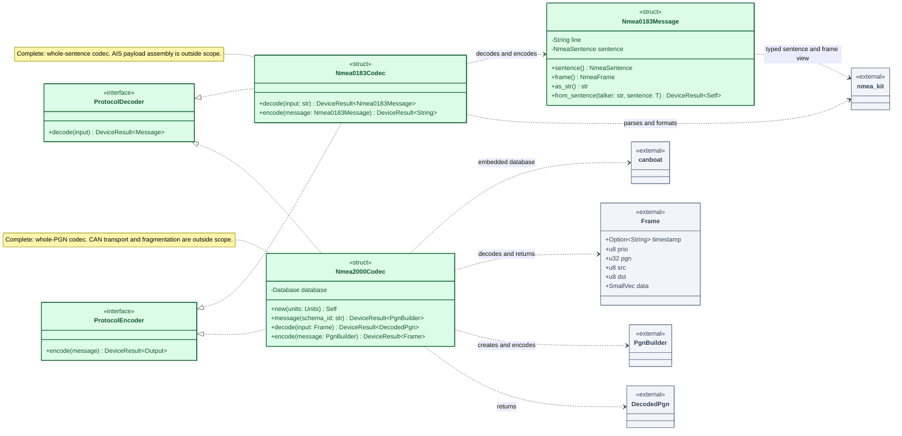
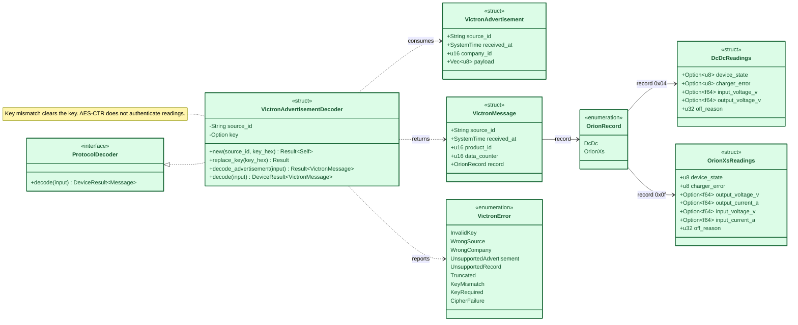
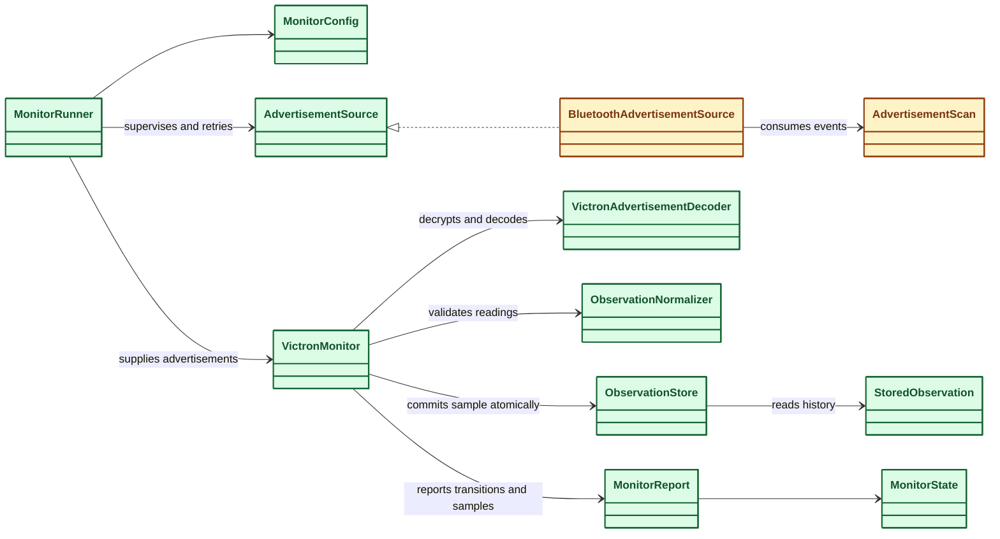

# Device Interface UML class diagram

This diagram describes the Rust code in `device-interface/src`, reviewed on
2026-10-01. Rust structs are shown as classes and traits as interfaces. It reflects
the current implementation rather than the proposed architecture.

Beta instrument connectivity is Bluetooth-only. Wi-Fi has been removed from the
active interfaces and diagrams and [shelved in the backlog](backlog.md#wi-fi-instrument-connectivity).

## Navigate to code

Click a class or interface to open its Rust definition. Project links are relative
to this document and include GitHub-style line anchors; editor previews may open
the file without jumping to the line. External nodes link to the pinned library
source or API documentation.

Diagram clicks require a Markdown viewer that permits
[Mermaid links](https://mermaid.js.org/syntax/classDiagram.html#interaction).
Viewers using Mermaid's strict security mode can disable them. The source index
below provides ordinary Markdown links as a fallback.

## Implementation status

Colors describe the code as of **2026-10-01**, within each component's stated
scope. Green means **100% implemented for that scope**, not complete support for
every protocol feature, platform or live device. Interfaces and data contracts
can be complete as definitions while their consuming pipeline remains unfinished.

| Color | Status | Components and scope |
| --- | --- | --- |
| 🟩 Green | 100% implemented within stated scope | `Nmea0183Codec`, `Nmea0183Message`, `Nmea2000Codec`: complete-message encoding/decoding; `VictronAdvertisementDecoder`: Orion DC/DC and XS advertisement decoding; `ProtocolDecoder`, `ProtocolEncoder`: implemented interface definitions; `CLI`: discovery, connection, foreground monitoring and history commands; `VictronMonitor`, `ObservationNormalizer`, `ObservationStore`: tested processing, validation and SQLite persistence; data structs/enums: existing field and variant definitions. |
| 🟨 Amber | In progress | `BluetoothAdapter`, `AdvertisementScan`, `BluetoothAdvertisementSource`: scanning and reception implemented, pending hardware/mobile validation; GATT notifications and unified transport integration remain unfinished. |
| 🟥 Red | Not implemented | `TransportAdapter`, `ConnectionManager`, `DeviceProtocolAdapter`: operational methods remain `NotImplemented` stubs. Constructors and type declarations do not count as operational implementation. |
| ⬜ Gray | External dependency | btleplug handles, nmea-kit, CANboat and their types. These are outside the project's implementation-status assessment. |

The same colors apply in all diagrams below. The table supplies text equivalents
so status does not depend on color alone. Data contracts remain provisional even
though their current definitions are implemented. Codec status excludes transport
framing, CAN fragmentation/reassembly, AIS payload assembly, normalization and
hardware integration; see the [NMEA usage guide](rust-nmea-libraries.md) and
[Victron vendor guide](../device-interface/vendor/README.md).

## Components and dependencies

```mermaid
classDiagram
    direction LR

    class BluetoothAdapter {
        <<struct>>
        -Option~Adapter~ adapter
        -BTreeMap discovered
        -Option~Peripheral~ connected
        +new(index: usize) DeviceResult~Self~
        +discover(duration: Duration) DeviceResult
        +connect_by_id(id: str) DeviceResult
        +connect(device: DeviceDescriptor) DeviceResult
        +disconnect() DeviceResult
        +start_advertisements() DeviceResult~AdvertisementScan~
        -register_known_address(id: str) DeviceResult~String~
    }
    class TransportAdapter {
        <<interface>>
        +discover() DeviceResult
        +connect(device: DeviceDescriptor) DeviceResult
        +disconnect() DeviceResult
        +try_receive() DeviceResult
    }
    class ConnectionManager {
        <<struct>>
        +new() Self
        +connect(device: DeviceDescriptor) DeviceResult
        +disconnect() DeviceResult
        +status() DeviceResult~ConnectionStatus~
        +set_reconnect_policy(policy: ReconnectPolicy) DeviceResult
    }
    class DeviceProtocolAdapter {
        <<interface>>
        +supports(device: DeviceDescriptor) DeviceResult~bool~
        +decode(frame: ReceivedFrame) DeviceResult
    }
    class ObservationNormalizer {
        <<struct>>
        +new() Self
        +normalize(reading: DecodedReading) DeviceResult~Observation~
    }
    class BtleplugAdapter {
        <<external>>
    }
    class BtleplugPeripheral {
        <<external>>
    }
    class CLI {
        <<binary>>
    }
    class ProtocolDecoder {
        <<interface>>
        +decode(input) DeviceResult~Message~
    }
    class ProtocolEncoder {
        <<interface>>
        +encode(message) DeviceResult~Output~
    }
    class Nmea0183Codec {
        <<struct>>
    }
    class Nmea2000Codec {
        <<struct>>
    }

    ProtocolDecoder <|.. Nmea0183Codec
    ProtocolEncoder <|.. Nmea0183Codec
    ProtocolDecoder <|.. Nmea2000Codec
    ProtocolEncoder <|.. Nmea2000Codec

    BluetoothAdapter --> "0..1" BtleplugAdapter : adapter handle
    BluetoothAdapter --> "0..*" BtleplugPeripheral : discovered handles by ID
    BluetoothAdapter --> "0..1" BtleplugPeripheral : selected connection handle
    CLI ..> BluetoothAdapter : awaits methods directly
    BluetoothAdapter ..> DeviceDescriptor : accepts and returns
    TransportAdapter ..> DeviceDescriptor : accepts and returns
    TransportAdapter ..> ReceivedFrame : returns optional frame
    ConnectionManager ..> DeviceDescriptor : accepts
    ConnectionManager ..> ConnectionStatus : returns
    ConnectionManager ..> ReconnectPolicy : accepts
    DeviceProtocolAdapter ..> DeviceDescriptor : checks support
    DeviceProtocolAdapter ..> ReceivedFrame : accepts
    DeviceProtocolAdapter ..> DecodedReading : returns list
    ObservationNormalizer ..> DecodedReading : accepts
    ObservationNormalizer ..> Observation : returns

    note for BluetoothAdapter "In progress: async discovery/connect/disconnect and manufacturer event reception implemented; physical validation pending. Notification reception and TransportAdapter integration remain unfinished."
    note for ConnectionManager "Stub: no adapter wiring or connection state storage yet."
    note for TransportAdapter "Synchronous trait. Default operations return NotImplemented."
    note for DeviceProtocolAdapter "Not implemented: reading adapter is a stub. NMEA codecs exist separately; no mapping to DecodedReading yet."
    note for ObservationNormalizer "Validates identifiers and finite values; preserves units and marks unavailable readings Unknown."

    style CLI fill:#dcfce7,stroke:#166534,color:#14532d,stroke-width:2px
    style ProtocolDecoder fill:#dcfce7,stroke:#166534,color:#14532d,stroke-width:2px
    style ProtocolEncoder fill:#dcfce7,stroke:#166534,color:#14532d,stroke-width:2px
    style Nmea0183Codec fill:#dcfce7,stroke:#166534,color:#14532d,stroke-width:2px
    style Nmea2000Codec fill:#dcfce7,stroke:#166534,color:#14532d,stroke-width:2px
    style DeviceDescriptor fill:#dcfce7,stroke:#166534,color:#14532d,stroke-width:2px
    style ReceivedFrame fill:#dcfce7,stroke:#166534,color:#14532d,stroke-width:2px
    style ConnectionStatus fill:#dcfce7,stroke:#166534,color:#14532d,stroke-width:2px
    style ReconnectPolicy fill:#dcfce7,stroke:#166534,color:#14532d,stroke-width:2px
    style DecodedReading fill:#dcfce7,stroke:#166534,color:#14532d,stroke-width:2px
    style Observation fill:#dcfce7,stroke:#166534,color:#14532d,stroke-width:2px
    style BluetoothAdapter fill:#fef3c7,stroke:#92400e,color:#78350f,stroke-width:2px
    style TransportAdapter fill:#fee2e2,stroke:#991b1b,color:#7f1d1d,stroke-width:2px
    style ConnectionManager fill:#fee2e2,stroke:#991b1b,color:#7f1d1d,stroke-width:2px
    style DeviceProtocolAdapter fill:#fee2e2,stroke:#991b1b,color:#7f1d1d,stroke-width:2px
    style ObservationNormalizer fill:#dcfce7,stroke:#166534,color:#14532d,stroke-width:2px
    style BtleplugAdapter fill:#f1f5f9,stroke:#64748b,color:#334155,stroke-width:1px
    style BtleplugPeripheral fill:#f1f5f9,stroke:#64748b,color:#334155,stroke-width:1px

    click CLI href "../device-interface/src/main.rs#L96" "Open CLI source or API"
    click ProtocolDecoder href "../device-interface/src/protocol.rs#L11" "Open ProtocolDecoder source or API"
    click ProtocolEncoder href "../device-interface/src/protocol.rs#L18" "Open ProtocolEncoder source or API"
    click Nmea0183Codec href "../device-interface/src/protocol/nmea0183.rs#L60" "Open Nmea0183Codec source or API"
    click Nmea2000Codec href "../device-interface/src/protocol/nmea2000.rs#L13" "Open Nmea2000Codec source or API"
    click DeviceDescriptor href "../device-interface/src/types.rs#L36" "Open DeviceDescriptor source or API"
    click ReceivedFrame href "../device-interface/src/types.rs#L68" "Open ReceivedFrame source or API"
    click ConnectionStatus href "../device-interface/src/types.rs#L53" "Open ConnectionStatus source or API"
    click ReconnectPolicy href "../device-interface/src/types.rs#L61" "Open ReconnectPolicy source or API"
    click DecodedReading href "../device-interface/src/types.rs#L83" "Open DecodedReading source or API"
    click Observation href "../device-interface/src/types.rs#L95" "Open Observation source or API"
    click BluetoothAdapter href "../device-interface/src/bluetooth.rs#L17" "Open BluetoothAdapter source or API"
    click TransportAdapter href "../device-interface/src/transport.rs#L6" "Open TransportAdapter source or API"
    click ConnectionManager href "../device-interface/src/connection.rs#L5" "Open ConnectionManager source or API"
    click DeviceProtocolAdapter href "../device-interface/src/protocol.rs#L28" "Open DeviceProtocolAdapter source or API"
    click ObservationNormalizer href "../device-interface/src/normalizer.rs#L5" "Open ObservationNormalizer source or API"
    click BtleplugAdapter href "https://docs.rs/btleplug/0.13.3/btleplug/platform/struct.Adapter.html" "Open BtleplugAdapter source or API"
    click BtleplugPeripheral href "https://docs.rs/btleplug/0.13.3/btleplug/platform/struct.Peripheral.html" "Open BtleplugPeripheral source or API"
```

Solid arrows represent stored handles; dotted arrows represent use through method
arguments or results. The hollow triangle denotes trait implementation. `btleplug`
handles are shared/clonable, so they are not shown as exclusively owned UML
compositions. A selected connection handle can be retained after a failed attempt
for cleanup; its presence alone does not establish a live connection.

All operations returning `DeviceResult` use the alias
`DeviceResult<T> = Result<T, DeviceError>`. To keep signatures readable, Rust
borrows and some nested generic return types are abbreviated:

| Method | Successful result |
| --- | --- |
| Both `discover` methods | `Vec<DeviceDescriptor>` |
| `TransportAdapter::try_receive` | `Option<ReceivedFrame>` |
| `DeviceProtocolAdapter::decode` | `Vec<DecodedReading>` |
| Connect, disconnect, and set-reconnect-policy operations | `()` |

`BluetoothAdapter::register_known_address` is private and platform-specific:
Windows can register an explicit Bluetooth address with btleplug; other platforms
currently return an error for an ID absent from discovery. The CLI uses
`connect_by_id` after scanning.

## Data contracts

`DecodedReading` and `Observation` are independent structs with matching fields;
neither inherits from the other. Missing timestamps and measurements remain
explicit through `Option`. Device IDs are opaque identifiers, not universally MAC
addresses.

## Source references

These links mirror every clickable diagram node.

| Class / interface | Definition or dependency source |
| --- | --- |
| `BluetoothAdapter` | [BluetoothAdapter](../device-interface/src/bluetooth.rs#L17) |
| `BtleplugAdapter` | [BtleplugAdapter](https://docs.rs/btleplug/0.13.3/btleplug/platform/struct.Adapter.html) |
| `BtleplugPeripheral` | [BtleplugPeripheral](https://docs.rs/btleplug/0.13.3/btleplug/platform/struct.Peripheral.html) |
| `CLI` | [CLI](../device-interface/src/main.rs#L96) |
| `ConnectionManager` | [ConnectionManager](../device-interface/src/connection.rs#L5) |
| `ConnectionState` | [ConnectionState](../device-interface/src/types.rs#L44) |
| `ConnectionStatus` | [ConnectionStatus](../device-interface/src/types.rs#L53) |
| `DecodedPgn` | [DecodedPgn](https://docs.rs/crate/canboat/8.3.0/source/src/engine/decode.rs) |
| `DecodedReading` | [DecodedReading](../device-interface/src/types.rs#L83) |
| `DeviceDescriptor` | [DeviceDescriptor](../device-interface/src/types.rs#L36) |
| `DeviceError` | [DeviceError](../device-interface/src/types.rs#L9) |
| `DeviceProtocolAdapter` | [DeviceProtocolAdapter](../device-interface/src/protocol.rs#L28) |
| `Frame` | [Frame](https://docs.rs/crate/canboat/8.3.0/source/src/engine/frame.rs) |
| `Nmea0183Codec` | [Nmea0183Codec](../device-interface/src/protocol/nmea0183.rs#L60) |
| `Nmea0183Message` | [Nmea0183Message](../device-interface/src/protocol/nmea0183.rs#L16) |
| `Nmea2000Codec` | [Nmea2000Codec](../device-interface/src/protocol/nmea2000.rs#L13) |
| `Observation` | [Observation](../device-interface/src/types.rs#L95) |
| `ObservationNormalizer` | [ObservationNormalizer](../device-interface/src/normalizer.rs#L5) |
| `PgnBuilder` | [PgnBuilder](https://docs.rs/crate/canboat/8.3.0/source/src/engine/encode.rs) |
| `ProtocolDecoder` | [ProtocolDecoder](../device-interface/src/protocol.rs#L11) |
| `ProtocolEncoder` | [ProtocolEncoder](../device-interface/src/protocol.rs#L18) |
| `QualityStatus` | [QualityStatus](../device-interface/src/types.rs#L75) |
| `ReceivedFrame` | [ReceivedFrame](../device-interface/src/types.rs#L68) |
| `ReconnectPolicy` | [ReconnectPolicy](../device-interface/src/types.rs#L61) |
| `TransportAdapter` | [TransportAdapter](../device-interface/src/transport.rs#L6) |
| `TransportKind` | [TransportKind](../device-interface/src/types.rs#L31) |
| `canboat` | [canboat](https://docs.rs/crate/canboat/8.3.0/source/src/lib.rs) |
| `nmea_kit` | [nmea_kit](https://docs.rs/crate/nmea-kit/0.8.9/source/src/lib.rs) |
| `VictronAdvertisementDecoder` | [VictronAdvertisementDecoder](../device-interface/vendor/victron/mod.rs#L111) |
| `VictronAdvertisement` | [VictronAdvertisement](../device-interface/vendor/victron/mod.rs#L20) |
| `VictronMessage` | [VictronMessage](../device-interface/vendor/victron/mod.rs#L30) |
| `OrionRecord` | [OrionRecord](../device-interface/vendor/victron/mod.rs#L39) |
| `DcDcReadings` | [DcDcReadings](../device-interface/vendor/victron/mod.rs#L47) |
| `OrionXsReadings` | [OrionXsReadings](../device-interface/vendor/victron/mod.rs#L58) |
| `VictronError` | [VictronError](../device-interface/vendor/victron/mod.rs#L70) |

- [Codec behavior tests](../device-interface/tests/nmea_codecs.rs)
- [Build and usage instructions](../device-interface/README.md)

The operational BLE adapter is not yet wired into the synchronous transport trait
or `ConnectionManager`. Notification reception, integration of the implemented
NMEA codecs into the transport pipeline, and the React Native bridge remain future
work. Victron advertisement monitoring, normalization and local storage are implemented.

## NMEA codec interfaces

See the [NMEA library usage guide](rust-nmea-libraries.md) for examples and library
configuration.

These transport-independent codecs operate on complete protocol messages, before
conversion into `DecodedReading`. The existing `DeviceProtocolAdapter` stub is a
separate normalization integration point.

0183 decodes `str` into an owned `Nmea0183Message` and encodes that message to a
checksummed CRLF string. Typed sentences construct outbound messages through
`Nmea0183Message::from_sentence`. 2000 decodes a complete CANboat `Frame` into
`DecodedPgn` and encodes a `PgnBuilder` into a complete `Frame`. Transport framing,
CAN reassembly/fragmentation and device I/O are outside both interfaces.

## Victron vendor decoding

The implementation is located directly under `device-interface/vendor/victron`.
The decoder consumes manufacturer advertisements for one configured source, with
its VictronConnect advertisement key. This is a separate protocol from NMEA.
Green indicates completed decoding for records 0x04 and 0x0f. The foreground
monitor receives advertisements, reloads a private key file, normalizes readings
and persists them to SQLite. Mobile secure storage and application integration
remain pending. No live-device interoperability has been verified.

See the [vendor guide](../device-interface/vendor/README.md) and
[fixture tests](../device-interface/tests/victron_decoder.rs) for supported layouts,
key lifecycle, error handling and limits.

## Live monitoring and local storage

See the [monitoring guide](victron-live-monitoring.md) for commands, key setup,
recovery behavior and the physical validation checklist. Green processing and
storage components are tested in software; amber radio components await physical
validation. `MonitorRunner` represents the async supervision function.

| Component | Source |
| --- | --- |
| `MonitorRunner` | [MonitorRunner](../device-interface/src/monitor.rs#L359) |
| `MonitorConfig` | [MonitorConfig](../device-interface/src/monitor.rs#L23) |
| `AdvertisementSource` | [AdvertisementSource](../device-interface/src/monitor.rs#L266) |
| `BluetoothAdvertisementSource` | [BluetoothAdvertisementSource](../device-interface/src/monitor.rs#L271) |
| `AdvertisementScan` | [AdvertisementScan](../device-interface/src/bluetooth.rs#L162) |
| `VictronMonitor` | [VictronMonitor](../device-interface/src/monitor.rs#L65) |
| `VictronAdvertisementDecoder` | [VictronAdvertisementDecoder](../device-interface/vendor/victron/mod.rs#L111) |
| `ObservationNormalizer` | [ObservationNormalizer](../device-interface/src/normalizer.rs#L5) |
| `ObservationStore` | [ObservationStore](../device-interface/src/store.rs#L18) |
| `MonitorReport` | [MonitorReport](../device-interface/src/monitor.rs#L57) |
| `MonitorState` | [MonitorState](../device-interface/src/monitor.rs#L48) |
| `StoredObservation` | [StoredObservation](../device-interface/src/store.rs#L23) |
