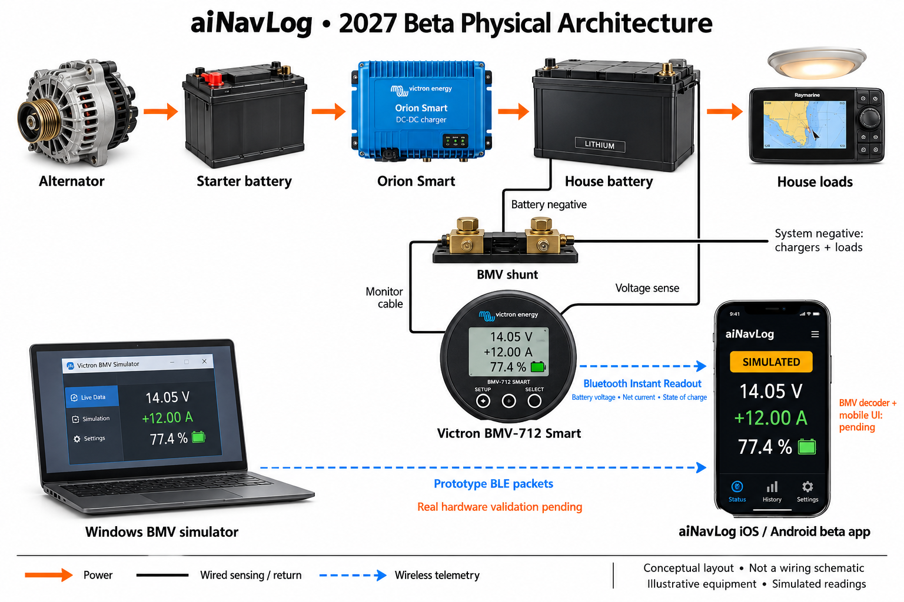
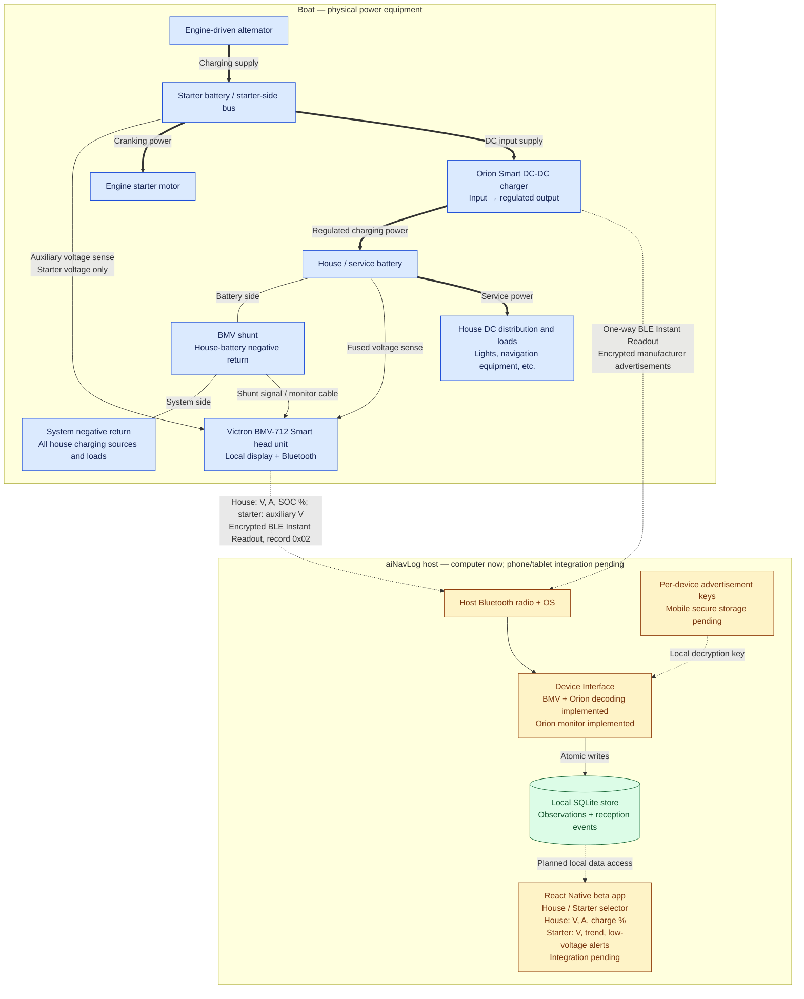

# BMV-712 Smart, Orion and aiNavLog — physical architecture

**Updated:** 2026-10-05. **Beta hardware decision:** use the Victron BMV-712
Smart with its shunt as the source of house-battery voltage, net current and state
of charge. Selected for the **2027 beta release**. Real BMV hardware validation and mobile
integration are pending; the Windows simulator has been received on an iPhone.

**Confirmed dual-battery approach:** one BMV-712 remains permanently connected
to the house-bank shunt. Configure its auxiliary input for starter-battery voltage.
The app provides a House / Starter view selector; no electrical switching of
batteries or shunts is required. House shows voltage, net current and charge %.
Starter shows voltage, voltage trend and low-voltage alerts; current and charge %
are unavailable. Starter SOC estimation is not part of this confirmed baseline.

The alternator supplies the starter-side electrical system. Orion charges the
house battery from that side. The BMV measures the house battery and its net
charge/discharge current through a shunt in the battery negative return. Its head
unit provides the physical display and Bluetooth telemetry. aiNavLog receives
telemetry and does not control charging or carry charging current.

BMV-712 is the selected battery-monitor integration for beta; Link 2000 is not the
selected telemetry source. This does not prescribe removal of existing equipment.
Orion remains a separate charger-telemetry source; real Orion key setup and
validation remain shelved until the device is available. The exact installed
charger model and boat wiring remain unconfirmed.

## Illustrated overview

Recognizable equipment illustrations make the technologies easier to identify.
Equipment appearance and screens are illustrative: both the laptop and phone UI
are concepts, not implemented dashboards. The displayed 14.05 V, +12.00 A and
77.4% are simulated readings from the prototype test. The BMV LCD is illustrative,
not a reproduction of its actual display layout. A lithium battery pictured here
does not select the boat's battery chemistry. Black lines summarize sensing/return
relationships; their attachment points are not terminal wiring instructions.
The illustration omits the newly confirmed starter auxiliary sense lead and
House / Starter UI selector; these are specified in the reference diagram below.

The detailed diagram below remains the technical reference. The earlier
[Orion-only illustration](images/orion-physical-architecture.png) is retained as a
historical charging overview; it omits the BMV/shunt and does not represent the
updated beta telemetry architecture.

## Detailed reference diagram

**Lines:** thick arrows show the functional DC power path; thin arrows show local
software data flow; dashed arrows show wireless data, key input or explicitly
planned integration. Undirected lines identify the shunt return relationship; current
can flow in either direction. These arrows are not individual electrical conductors.

**Colors:** blue identifies physical boat equipment; green identifies implemented
software; amber identifies pending provisioning, integration or physical validation.
The phone/tablet uses its own power supply/battery; an optional boat charging
connection is omitted. The Rust host components share one host; SQLite is not a
separate onboard appliance or cloud server. VictronConnect may run on that phone
or on another nearby phone for setup.

## Setup relationship

VictronConnect configures the BMV-712 (and separately Orion) and provides Instant
Readout details. The owner enables Instant Readout and copies its advertisement
key into the private file used by the current aiNavLog monitor. Routine aiNavLog
reception listens to broadcasts without pairing a telemetry session or sending
control commands. The BMV head unit broadcasts; the shunt itself is wired.
Battery capacity, charge parameters and synchronization must be configured for
meaningful SOC. All house charge/discharge current must pass through the shunt.
See the [BMV installation manual](https://www.victronenergy.com/media/pg/BMV-712_Smart/en/installation.html).
See [Victron's Instant Readout overview](https://www.victronenergy.com/media/pg/VictronConnect_app/en/stored-trends---instant-readout.html)
and the [local setup guide](victron-live-monitoring.md).

## What aiNavLog can infer

| Observation | Meaning and limit |
| --- | --- |
| BMV battery voltage | Primary beta UI voltage, measured for the house bank. |
| BMV battery current | Primary beta UI amperage: positive charging, negative discharging; net battery current, not charger output current. |
| BMV state of charge | Primary beta UI charge percentage, calculated by the monitor; depends on configuration and synchronization. |
| BMV auxiliary input | Configured for starter-battery voltage in beta; starter current and SOC remain unavailable. This uses the auxiliary input instead of midpoint or temperature sensing. |
| Orion input voltage | Voltage reported at the charger input; associated with the starter side in this assumed layout. |
| Orion output voltage | Voltage reported at the charger output; associated with the house charging side. |
| Device state, error and off-reason | Charger-reported operating status, preserved by the decoder. |
| Input/output current | Supported by our Orion XS record decoder; absent from the supported Orion-Tr DC/DC record. |
| Load consumption | Net BMV battery current does not isolate individual loads or total load current while charging sources are active. |

Terminal readings are not independent measurements at each battery and do not
establish battery health. The broadcasts use Victron's vendor format, not NMEA
0183 or NMEA 2000. The NMEA codecs are separate paths in the Device Interface.

## Scope of this drawing

This is an architecture diagram, not an installation wiring schematic. It omits
complete return wiring, fuses, disconnects, cable sizing, BMS/remote-enable
wiring and other charging sources. Isolated and non-isolated Orion variants differ
in their return arrangements; use the manual for the actual model when documenting
or changing physical wiring. No wiring changes are proposed here.

The Orion decoder, monitor and store are software-tested. BMV decoding and normalization in the
production Device Interface are implemented and software-tested. The BMV Windows broadcaster
currently disables auxiliary input and therefore needs starter-voltage simulation
to cover the confirmed dual-battery setup. It has independent discharge/charge encryption fixtures, and a user-reported iPhone
packet decoded to 14.05 V, +12.00 A and 77.4% SOC. This validates a simulated
radio path, not physical BMV accuracy or the aiNavLog UI.
See the [BMV simulator](../simulation/bmv712/README.md). Actual Orion reception and
reading accuracy are still unverified; mobile packaging, permissions, secure key
storage and background operation remain pending.

Related: [software class diagram](device-interface-class-diagram.md),
[current handoff](status-2026-10-02.md), [monitor source](../device-interface/src/monitor.rs),
[store source](../device-interface/src/store.rs).
