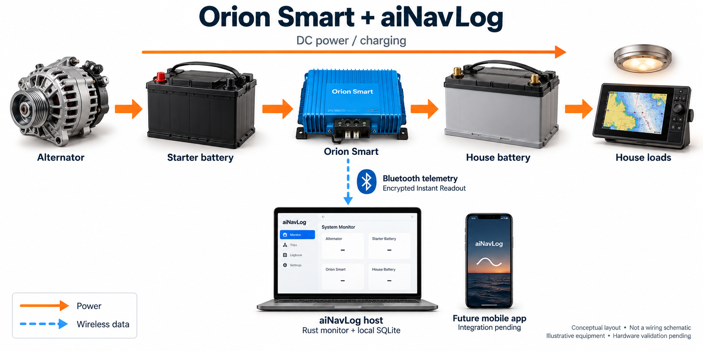
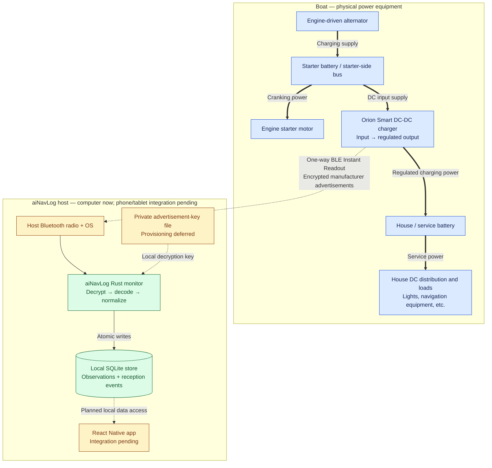

# Orion Smart and aiNavLog — physical architecture

**Updated:** 2026-10-02. Conceptual dual-battery boat layout; the exact Orion model,
voltage ratings and installed boat wiring have not been confirmed. Orion key setup
and physical validation remain shelved until the device is nearby.

The alternator supplies the starter-side electrical system. The Orion takes DC
power from that side and regulates charging of the house/service battery. This is
the dual-battery application described by [Victron for Orion-Tr Smart](https://www.victronenergy.com/dc-dc-converters/orion-tr-smart).
aiNavLog observes the Orion over Bluetooth; it is not in the charging circuit.

## Illustrated overview

Equipment and screens are illustrative, not photographs of the installed system.
The laptop screen is a concept mockup; the implemented host currently uses a CLI.
Only Orion telemetry is received here; no independent alternator/battery sensors
or working graphical dashboard are implied. Orange arrows show power flow; the
blue dashed arrow shows Bluetooth telemetry.

## Detailed reference diagram

**Lines:** thick arrows show the functional DC power path; thin arrows show local
software data flow; dashed arrows show wireless data, key input or explicitly
planned integration. These arrows are not individual electrical conductors.

**Colors:** blue identifies physical boat equipment; green identifies implemented
software; amber identifies pending provisioning, integration or physical validation.
The phone/tablet uses its own power supply/battery; an optional boat charging
connection is omitted. The Rust host components share one host; SQLite is not a
separate onboard appliance or cloud server. VictronConnect may run on that phone
or on another nearby phone for setup.

## Setup relationship

VictronConnect connects to the Orion for configuration and access to Instant
Readout details. The owner enables Instant Readout and copies its advertisement
key into the private file used by the current aiNavLog monitor. Routine aiNavLog
reception listens to broadcasts without a charger connection or control commands.
See [Victron's Instant Readout overview](https://www.victronenergy.com/media/pg/VictronConnect_app/en/stored-trends---instant-readout.html)
and the [local setup guide](victron-live-monitoring.md).

## What aiNavLog can infer

| Observation | Meaning and limit |
| --- | --- |
| Orion input voltage | Voltage reported at the charger input; associated with the starter side in this assumed layout. |
| Orion output voltage | Voltage reported at the charger output; associated with the house charging side. |
| Device state, error and off-reason | Charger-reported operating status, preserved by the decoder. |
| Input/output current | Supported by our Orion XS record decoder; absent from the supported Orion-Tr DC/DC record. |
| Battery state of charge and total house consumption | Not supplied by the implemented Orion records. Requires additional battery-monitor/shunt integration. |

Terminal readings are not independent measurements at each battery and do not
establish battery health. The broadcasts use Victron's vendor format, not NMEA
0183 or NMEA 2000. The NMEA codecs are separate paths in the Device Interface.

## Scope of this drawing

This is an architecture diagram, not an installation wiring schematic. It omits
negative/return conductors, fuses, disconnects, cable sizing, BMS/remote-enable
wiring and other charging sources. Isolated and non-isolated Orion variants differ
in their return arrangements; use the manual for the actual model when documenting
or changing physical wiring. No wiring changes are proposed here.

The decoder, monitor and store are software-tested. Actual Orion reception and
reading accuracy are still unverified; mobile packaging, permissions, secure key
storage and background operation remain pending.

Related: [software class diagram](device-interface-class-diagram.md),
[current handoff](status-2026-10-02.md), [monitor source](../device-interface/src/monitor.rs),
[store source](../device-interface/src/store.rs).
